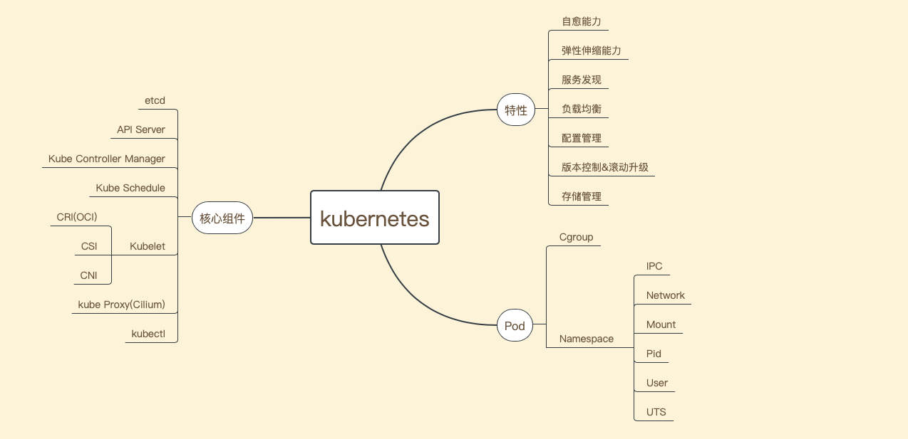

记录学习和使用k8s的点点滴滴
=====================

> 使用和学习k8s/service mesh已经快两年了, 想把学习的内容整合起来串一串. 线上业务直接使用的腾讯云的TKE环境以及自己公司内部的一些工具. 但是一直想从一台裸机慢慢构建自己的高可用k8s集群, 并在这个k8s集群上搭建一套微服务(istio服务网格)的环境出来. 最终目的是为了完善自己的知识体系以及构建出自己工程技术方法论. 下面介绍本网站的几个模块. 

#### 环境准备

> 环境准备, 是基于一台云主机(公网IP, 域名解析), frp插件(内网穿透, 连接本地主机和云主机), 虚拟化技术(创建多个虚拟机搭建高可用k8s集群), 最终将本地的k8s集群暴露到公网. 

#### k8s搭建

> k8s搭建, 介绍了构建虚拟机的基础镜像(保证所有的节点镜像一致), 以及基于keepalived和nginx(也可以使用lvs或者haproxy)搭建k8s高可用集群. 

#### 统一认证

> 统一认证, 是基于keycloak的OIDC解决方案. 搭建的平台都是基于keycloak实现统一的OIDC认证. 存储账号是使用freeipa解决方案, keycloak与freeipa之间通过ldap进行通信(也可以使用kerberos).

#### DevOps

> devops, 介绍从push代码到git仓库(gitea), 通过webhook触发事件执行CI流水线(drone), 然后打包代码, 构建镜像并推送到harbor仓库, 最后通过helm部署到k8s集群的整个过程. 

#### 日志监控

> 日志监控, 介绍日志收集的解决方案(elk)和集群监控解决方案(thanos, grafana, alertmanager). 

#### k8s基础

> k8s基础, 简单介绍了k8s的架构, 以及在日常使用k8s需要使用的知识点. 

#### Service Mesh

> Service Mesh 基于istio解决方案实现, 包括链路追踪, 服务可观测平台以及服务网格. 