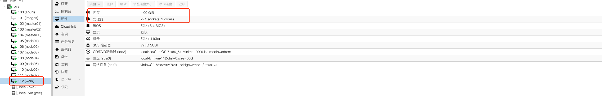

Devops环境配置
=================

> 主要基于gitea/drone/helm在k8s平台上实现CI/CD功能。 

## 发布机器

基于基础镜像克隆一个2C4G的虚拟机，只用于构建发布机器（在k8s集群之外）和对k8s集群的运维操作。 



- git 升级
  ```bash
  安装新版本git 
  #!/bin/bash
  cat > /etc/yum.repos.d/wandisco-git.repo <<<EOF
    [wandisco-git]
    name=Wandisco GIT Repository
    baseurl=http://opensource.wandisco.com/centos/7/git/$basearch/
    enabled=1
    gpgcheck=1
    gpgkey=http://opensource.wandisco.com/RPM-GPG-KEY-WANdisco
  EOF;
  rpm --import http://opensource.wandisco.com/RPM-GPG-KEY-WANdisco
  yum -y install git
  # git version 2.22.0
  ```
- 配置kube config
  配置kube config, 可以执行kubectl 命令。 
  ```bash
  #!/bin/bash
  mkdir -p ~/.kube
  # 把master上的kube config复制到当前机器上
  copy ${MASETER}/.kube/config ~/.kube/config
  chmod 600 ~/.kube/config
  ```
- 配置helm
  安装helm, 并配置helm仓库
  ```bash
  #!/bin/bash
  curl -O https://get.helm.sh/helm-v3.4.0-linux-amd64.tar.gz
  tar zxvf helm-v3.4.0-linux-amd64.tar.gz
  cp linux-amd64/helm /usr/local/bin/
  chmod +x /usr/local/bin/helm
  rm -rf linux-amd64
  rm -rf helm-v3.4.0-linux-amd64.tar.gz
  helm repo add stable https://charts.helm.sh/stable
  helm plugin install https://github.com/chartmuseum/helm-push.git
  ```