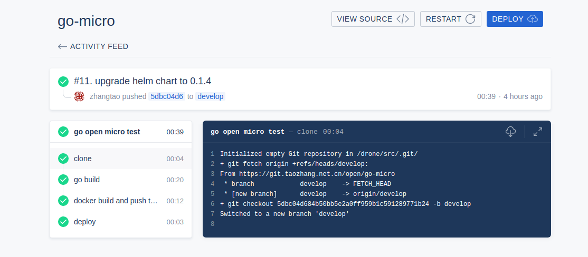
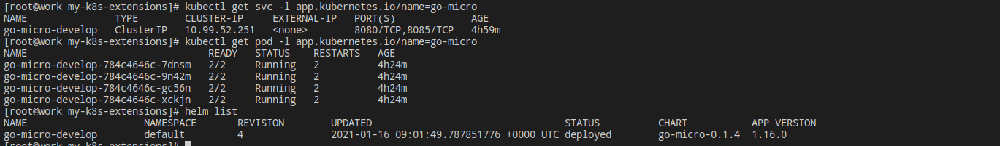

综合应用
============

> 以golang为例子，基于harbor/gitea/helm/drone实现CI/CD的功能．

## 流水线执行步骤
1. 写代码，提交代码到gitea仓库
2. gitea通过webhook将事件推送给drone
3. drone 拉取代码，读取.drone.yml文件执行配置中的steps流水线
4. steps步骤（可配置，比如可以增加lint代码检查等，下面以最简单的Demo为例子）
   - clone触发事件的代码分支(默认)
   - go build, 将源代码编译为二进制文件
   - 基于Dockerfile, 将二进制文件打包为镜像，并推送到harbor仓库
   - helm 配置charts仓库, 下载go-micro chart应用包
   - 基于上面的打好包的镜像，执行helm　install, 安装go-micro应用包

## Go Demo

- [go library](https://git.taozhang.net.cn/open/go-library)  
  自己写的一些通用库文件，后续慢慢补充．　
- [go micro](https://git.taozhang.net.cn/open/go-micro)  
  基于go library, 实现了一个小[Demo](https://devops.taozhang.net.cn/v1/test/125), 配置好了CI/CD流程，写好代码提交代码，会自动通过drone走流水线.


## Dockerfile

也可以直接在[我的代码仓库](https://git.taozhang.net.cn/open/go-micro/src/branch/develop/Dockerfile)看，用于在CI流程中，将源代码build为二进制文件打包为镜像，并推送到harbor平台．　

```yaml
FROM harbor.taozhang.net.cn/devops/alpine:3.12
MAINTAINER zhangtao <594909494@qq.com>
# 参数化构建
ARG DRONE_REPO_NAME
ENV TZ=Asia/Shanghai
COPY app "/data/www/${DRONE_REPO_NAME}/"
WORKDIR "/data/www/${DRONE_REPO_NAME}"
EXPOSE 8080
EXPOSE 8085
STOPSIGNAL SIGTERM
ENTRYPOINT ["./app", "-c", "app.yaml"]
```

## .drone.yml文件

可以参考[drone官方文档](https://docs.drone.io/pipeline/kubernetes/syntax/metadata/)，在k8s平台中的语法．我的代码仓库也有我自己写的[drone配置](https://git.taozhang.net.cn/open/go-micro/src/branch/develop/.drone.yml), 也可以参考．下面是流水线四个主要流程：

```yaml
steps:
  - name: go build
    image:  golang:latest
    volumes:
      - name: go-cache
        path: /data/go-cache
    environment:
      GOPROXY: https://goproxy.cn,direct
      GOPRIVATE: git.taozhang.net.cn
      GOOS: linux
      GOARCH: amd64
      CGO_ENABLED: 0
      GOPATH: /data/go-cache
    commands:
      - go mod tidy
      - go build -o app
  - name: docker build and push to harbor
    image: plugins/docker
    settings:
      build_args_from_env:
        - DRONE_REPO_NAME
      registry: harbor.taozhang.net.cn
      repo: harbor.taozhang.net.cn/open/go-micro
      use_cache: true
      username:
        from_secret: harbor_username
      password:
        from_secret: harbor_password
      tags:
        - ${DRONE_BRANCH}-${DRONE_COMMIT_SHA:0:8}
  - name: deploy
    image: alpine
    volumes:
      - name: kube-config
        path: /root/.kube
      - name: bin-path
        path: /usr/local/bin
    environment:
      USERNAME:
        from_secret: harbor_username
      PASSWORD:
        from_secret: harbor_password
      CHAR_VERSION: 0.1.4
    commands:
      - helm repo add
        --username $USERNAME
        --password $PASSWORD
        myopen https://harbor.taozhang.net.cn/chartrepo/open
      - helm repo update
      - helm upgrade --install
        --version $CHAR_VERSION
        "go-micro-${DRONE_BRANCH}"
        -n default
        --set image.tag="${DRONE_BRANCH}-${DRONE_COMMIT_SHA:0:8}"
        -f "./helm/values.${DRONE_BRANCH}.yaml"
        myopen/go-micro
    when:
      event: push
      branch:
        - develop
        - release
```


## helm应用包

helm应用包，编写比较简单，这个是写的[我的应用包Demo（点击可下载）](https://www.taozhang.net.cn/devops/blob/go-micro-0.1.4.tgz)．


