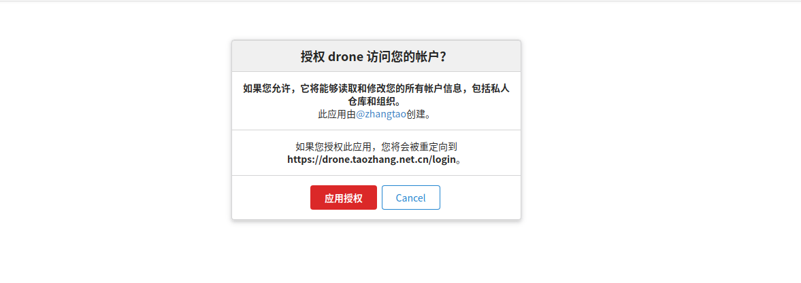

drone工具
==============

> Drone CI工具非常简单（相对于Jenkins）．满足CI/CD能力，并提供了很多插件（Github, Email, helm, 微信）等．　

## 安装部署
安装很简单，直接使用helm安装即可．　
```yaml
helm repo add drone https://charts.drone.io
helm repo update

# install or update server 
helm  upgrade --install  drone drone/drone \
--namespace kube-devops \
-f drone-server-values.yaml

# install or update runner 
helm upgrade --install   drone-runner-kube drone/drone-runner-kube \
--namespace  kube-devops \
-f drone-runner-values.yaml

# install or update secrets
helm upgrade --install  drone-kubernetes-secrets drone/drone-kubernetes-secrets \
--namespace  kube-devops \
-f drone-kubernetes-secrets-values.yaml
```


## gitea授权




## drone配置

- 同步代码仓库
  

- 激活项目
　点击Active, 激活（可以接受gitea的web hook了，　进而可以进行CI流水线了). 

- 配置参数
  
  drone配置项分为 Main, Sercets, CronJob, Badges四个项，慢慢再介绍．　