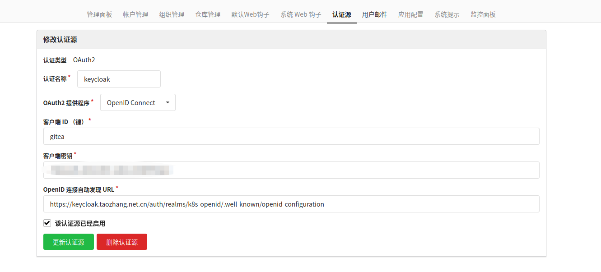
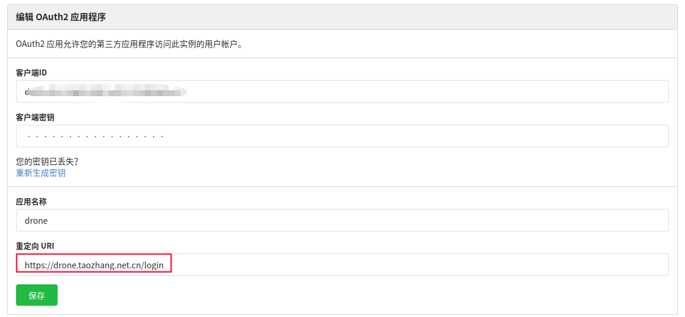

自建代码仓库
==============
> gitea是一个极易安装，运行非常快速，安装和使用体验良好的自建 Git 服务。我把我的代码仓库，freeipa, keycloak, harbor都以docker-compose的方式部署在了腾讯云，而不是k8s集群中（k8s集群经常因升级/测试，反复多次安装，所以这部分不经常变动的就放到了腾讯云上）．

## 部署

```yaml
version: "3"

networks:
  gitea:
    external: false
# 部分敏感信息使用${}替换．
services:
  server:
    image: gitea/gitea:1.13.1
    container_name: gitea
    environment:
      - APP_NAME=代码仓库
      - RUN_MODE=prod
      - DOMAIN=git.taozhang.net.cn
      - SSH_DOMAIN=git.taozhang.net.cn
      - SSH_PORT=22
      - ROOT_URL=https://git.taozhang.net.cn
      - USER_UID=1000
      - USER_GID=1000
      - DB_TYPE=mysql
      - DB_HOST=${DB_HOST}
      - DB_NAME=${DB_NAME
      - DB_USER=${DB_USER}
      - DB_PASSWD=${DB_PASS}
    restart: always
    networks:
      - gitea
    volumes:
      - /data/vdb/gitea:/data
      - /etc/timezone:/etc/timezone:ro
      - /etc/localtime:/etc/localtime:ro
    ports:
      - "3000:3000"
      - "3022:22"

```

## 配置SSO(keycloak)
  
个人> 管理后台> 认证源

|配置项| 配置值|
| --- | --- |
| 认证类型| OAuth2 |
| 认证名称| keycloak |
| OAuth2提供程序| OpenID Connect|
| 客户端ID | gitea(keycloak中配置) |
| 客户端秘钥| xxxxx(keycloak中配置)|
| OpenID 自动发现URL | https://keycloak.taozhang.net.cn/auth/realms/k8s-openid/.well-known/openid-configuration|



## 配置CI工具(Drone)

个人> 设置> 应用> 创建新的OAuth2应用程序
   
| 配置项 | 配置值|
| ---| --- |
| 客户端ID| 自动生成 |
| 客户端秘钥| 自动生成|
| 应用名称 | drone |
| 重定向 | https://drone.taozhang.net.cn/login |

- 配置drone应用


- 同意drone 授权访问gitea仓库　　

