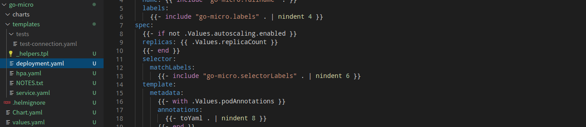

helm工具
=================

> 管理 Kubernetes 应用程序——Helm Charts 帮助您定义、安装和升级最复杂的 Kubernetes 应用程序。

## 安装部署

```bash
#!/usr/bin/env bash
curl -O https://get.helm.sh/helm-v3.4.0-linux-amd64.tar.gz
tar zxvf helm-v3.4.0-linux-amd64.tar.gz
cp linux-amd64/helm /usr/local/bin/
chmod +x /usr/local/bin/helm
rm -rf linux-amd64
rm -rf helm-v3.4.0-linux-amd64.tar.gz
helm repo add stable https://charts.helm.sh/stable
helm plugin install https://github.com/chartmuseum/helm-push.git
```

## 添加私有charts

```bash
helm repo add myrepo https://harbor.taozhang.net.cn/chartrepo/repo --username ${USER} --password ${PASSWORD}
helm repo update

# helm repo update
#Hang tight while we grab the latest from your chart repositories...
#...Successfully got an update from the "myrepo" chart repository
#...Successfully got an update from the "drone" chart repository
#...Successfully got an update from the "stable" chart repository
#Update Complete. ⎈Happy Helming!⎈
```

## 编写chart/打包上传

- 创建模板  
  ```bash
  helm create go-micro
  ```
  
- 编写helm chart  
  需要熟悉，go template语法，熟悉以后，只需要改上面创建的模板即可，很简单．　
- 预执行检查语法是否错误  
  ```bash
  helm upgrade --install --dry-run --debug -n default -f go-micro/values.yaml go-micro go-micro
  ```
  如果出现错误，会有提示，需要修改模板，直到成功为止．　　
  
- 上传到harbor chart 仓库  
  ```bash
  # 创建一个开放的Open chart仓库
  helm repo add --username ${USERNAME} --password ${PASSWORD} myopen https://harbor.taozhang.net.cn/chartrepo/open
  # 执行打包
  helm package go-micro  
  # 推送到chart仓库
  helm push go-micro-0.1.0.tgz myopen
  ```
  
