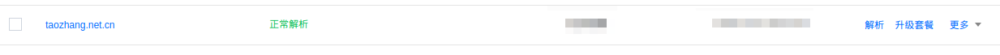

配置腾讯云主机
=========================

> 买腾讯云主机的目的用来做外网网关。云主机具有公网IP。

#### 入站规则安全组

| 来源 | 端口 | 策略 |
| --- | ---  | --- |
| 0.0.0.0/0 | TCP:80,443 | 放开|

入站规则主要是放开web端口。

#### 出站规则

| 来源 | 端口 | 策略 |
| --- | ---  | --- |
| 0.0.0.0/0 | ALL | 放开|

出站规则都放开。

#### 配置域名解析

[腾讯云控制台](https://console.cloud.tencent.com/cns)添加域名解析,域名申请和网站备案略。

