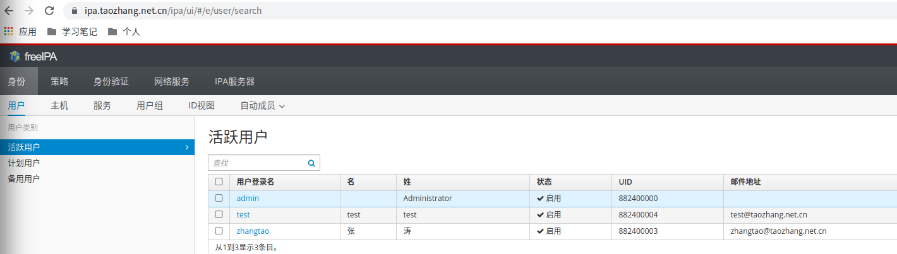

配置freeipa
======================

> FreeIPA是一款集成的安全信息管理解决方案。FreeIPA包含389 Directory Server MIT Kerberos, NTP, DNS, Dogtag (Certificate System)等等身份，认证和策略功能。

freeipa是为后面k8s集群的各种应用提供统一身份解决方案.

#### centos7配置freeipa

```bash
LOCAL_IP=
DOMAIN=
MAIN_DOMAIN=
REALM=
PASS=

yum install ipa-server -y

echo "${LOCAL_IP} ${MAIN_DOMAIN}.${DOMAIN} ${MAIN_DOMAIN}" >> /etc/hosts

hostnamectl set-hostname  ${MAIN_DOMAIN}.${DOMAIN}

cat > /etc/sysctl.d/close_ipv6.conf <<EOF
net.ipv6.conf.all.disable_ipv6=0
EOF
sysctl net.ipv6.conf.all.disable_ipv6=0
ipa-server-install -a ${PASS} -p ${PASS} --domain=${DOMAIN} --realm=${REALM}

firewall-cmd --permanent --add-service={ntp,http,https,ldap,ldaps,kerberos,kpasswd}
firewall-cmd --reload
```
配置完截图:

