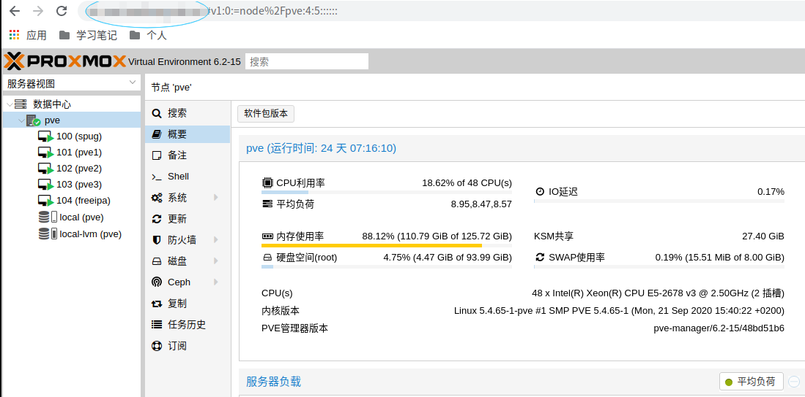
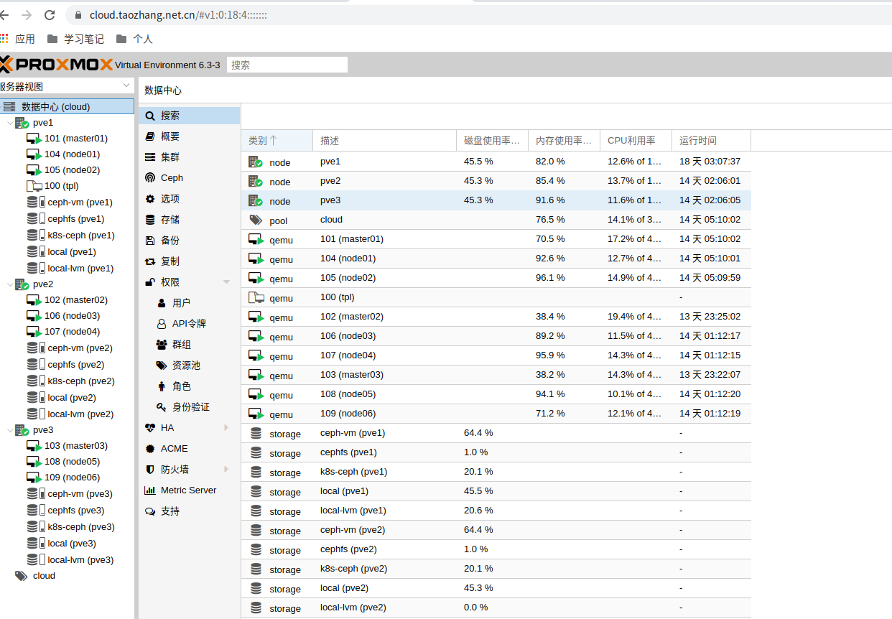
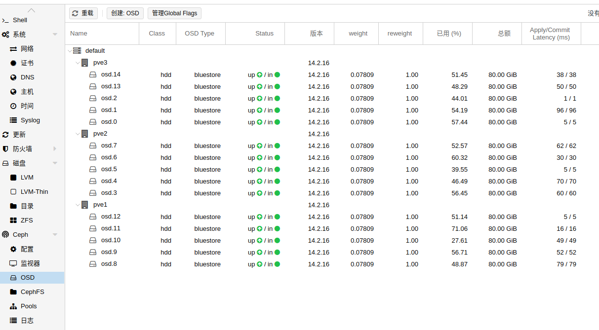

本地电脑虚拟化
=========================

> 搭建高可用k8s集群最少需要3个节点，我将我的高配置电脑虚拟化为最少9个节点，3个主节点，6个从节点。

## proxmox ve虚拟化软件

使用[proxmox ve](https://pve.proxmox.com/wiki/Main_Page)对本地电脑进行虚拟化。proxmox是一个开源免费的基于linux的企业级虚拟化方案.

proxmox ve安装跟安装linux操作系统一样简单，将iso镜像刻录到u盘中，然后安装proxmox操作系统。

#### 资源分配

| 虚拟机名称| 分配CPU | 分配内存 | 分配硬盘|  用途 |
| --- | --- | --- | --- | --- |
| pve1 | 16 core | 40G | 5 * 50G | 用于嵌套虚拟化 |
| pve2 | 16 core | 40G | 5 * 50G | 用于嵌套虚拟化| 
| pve3 | 16 core | 40G | 5 * 50G | 用于嵌套虚拟化|
| spug | 4 core | 2G | 32G| 安装[spug](https://github.com/openspug/spug)主机管理软件 |
| ipa | 4 core | 2G | 32G | 安装[freeipa](https://www.freeipa.org/page/Main_Page)用于账号管理|

#### 嵌套虚拟化

> 为什么要做嵌套虚拟化, 为了模拟真实的环境(proxmox 超融合), 对pve做了嵌套虚拟化, 在pve上安装三个pve虚拟机(pve1, pve2, pve3, 每个都分配了16 core, 40G内存, 5*80G硬盘). 基于这些配置构建超融合, 超融合能够最大限度的实现数据中心容量扩展性和数据的可用性.

**超融合**

**ceph分布式存储**

