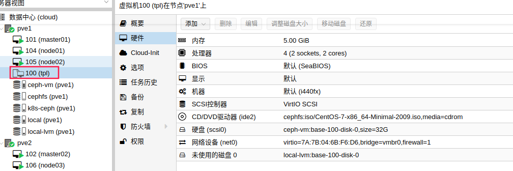

配置k8s基础镜像
===============

> 所有节点使用统一的镜像. 方便后续快速增加节点.


## 基础系统

基于centos7系统,升级内核到5.8. 

```bash
#!/bin/bash
rpm --import https://www.elrepo.org/RPM-GPG-KEY-elrepo.org
rpm -Uvh https://www.elrepo.org/elrepo-release-7.0-3.el7.elrepo.noarch.rpm
yum --enablerepo=elrepo-kernel install -y  kernel-ml-devel kernel-ml
grub2-set-default 0
grub2-mkconfig -o /boot/grub2/grub.cfg
```


## k8s基础环境配置

主要是安装kubeadm, kubelet, nfs client, ceph client, docker, 以及一些内核优化.

```bash
#!/bin/bash

set -o errexit

## CRI 安装 ###############################################################
yum-config-manager \
--add-repo \
https://download.docker.com/linux/centos/docker-ce.repo

yum update -y && yum install -y --setopt=obsoletes=0 \
docker-ce

mkdir -p /etc/docker
cat > /etc/docker/daemon.json <<EOF
{
  "exec-opts": ["native.cgroupdriver=systemd"],
  "log-driver": "json-file",
  "log-opts": {
    "max-size": "100m"
  },
  "storage-driver": "overlay2",
  "storage-opts": [
    "overlay2.override_kernel_check=true"
  ],
  "registry-mirrors": ["https://eknk9xgk.mirror.aliyuncs.com"]
}
EOF

mkdir -p /etc/systemd/system/docker.service.d

systemctl enable docker.service
systemctl daemon-reload
systemctl restart docker

### ipvs ###

# docker run -d --restart=always --network=host --name=spug -p 80:80 -v /mydata/:/data registry.aliyuncs.com/openspug/spug

yum -y install ipvsadm  ipset

# 优化kernal
modprobe br_netfilter
cat > /etc/sysconfig/modules/br_netfilter.modules << EOF
modprobe br_netfilter
EOF
chmod 755 /etc/sysconfig/modules/br_netfilter.modules
# 禁用ipv6
cat > /etc/sysctl.d/k8s.conf <<EOF
net.ipv6.conf.all.disable_ipv6=1
net.ipv6.conf.default.disable_ipv6=1
net.ipv6.conf.lo.disable_ipv6=1
net.bridge.bridge-nf-call-ip6tables = 1
net.bridge.bridge-nf-call-iptables = 1
net.core.somaxconn = 32768
net.ipv4.tcp_syncookies = 0
net.ipv4.ip_forward = 1
net.ipv4.conf.all.rp_filter = 1
net.ipv4.neigh.default.gc_thresh1 = 80000
net.ipv4.neigh.default.gc_thresh2 = 90000
net.ipv4.neigh.default.gc_thresh3 = 100000
vm.swappiness=0
fs.file-max = 1000000
fs.inotify.max_user_watches = 1048576
fs.inotify.max_user_instances = 1024
EOF
sysctl -p /etc/sysctl.d/k8s.conf

# 永久生效
cat > /etc/sysconfig/modules/ipvs.modules <<EOF
modprobe -- ip_vs
modprobe -- ip_vs_rr
modprobe -- ip_vs_wrr
modprobe -- ip_vs_sh
modprobe -- nf_conntrack
EOF
# modprobe -- nf_conntrack_ipv4
chmod 755 /etc/sysconfig/modules/ipvs.modules
bash /etc/sysconfig/modules/ipvs.modules
#lsmod | grep -e ip_vs -e nf_conntrack

## CRI-O install ######################################################################
cat <<EOF > /etc/yum.repos.d/kubernetes.repo
[kubernetes]
name=Kubernetes
baseurl=https://mirrors.aliyun.com/kubernetes/yum/repos/kubernetes-el7-x86_64
enabled=1
gpgcheck=1
repo_gpgcheck=1
gpgkey=https://mirrors.aliyun.com/kubernetes/yum/doc/yum-key.gpg https://mirrors.aliyun.com/kubernetes/yum/doc/rpm-package-key.gpg
EOF

yum install -y kubelet-1.19.3 kubeadm-1.19.3 kubectl-1.19.3 --disableexcludes=kubernetes
systemctl enable kubelet && systemctl start kubelet

# 优化内核参数
swapoff -a
sed -ri 's/.*swap.*/#&/' /etc/fstab

mount bpffs /sys/fs/bpf -t bpf
echo "bpffs  /sys/fs/bpf   bpf  defaults 0 0" >> /etc/fstab
cat >  /etc/security/limits.conf <<EOF
* soft nofile  1048576
* hard nofile  1048576
* soft stack   10240
* soft nproc 32000
* hard nproc 32000
* soft memlock unlimited
* hard memlock unlimited
EOF

cat >  /etc/systemd/system.conf <<EOF
DefaultLimitNOFILE=65536
DefaultLimitNPROC=32000
DefaultLimitMEMLOCK=infinity
EOF
systemctl daemon-reload

# 安装nfs client
yum install -y nfs-utils

# 安装ceph
cat > /etc/yum.repos.d/ceph.repo <<EOF
[Ceph]
name=Ceph packages for $basearch
baseurl=http://mirrors.aliyun.com/ceph/rpm-nautilus/el7/x86_64/
enabled=1
gpgcheck=0
type=rpm-md
gpgkey=https://download.ceph.com/keys/release.asc
[Ceph-noarch]
name=Ceph noarch packages
baseurl=http://mirrors.aliyun.com/ceph/rpm-nautilus/el7/noarch
enabled=1
gpgcheck=0
type=rpm-md
gpgkey=https://download.ceph.com/keys/release.asc
[ceph-source]
name=Ceph source packages
baseurl=http://mirrors.aliyun.com/ceph/rpm-nautilus/el7/SRPMS
enabled=1
gpgcheck=0
type=rpm-md
gpgkey=https://download.ceph.com/keys/release.asc
EOF
yum clean all &&  yum makecache
# 版本跟 ceph 保持一致
yum -y install ceph-common-14.2.11

```

#### 制作基础镜像

上面的系统安装好后, 在pve中将系统转为模板, k8s所有的节点都是基于当前模板配置.

