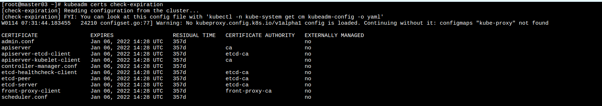
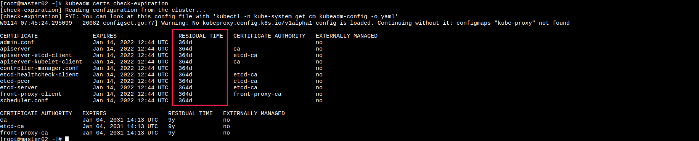

证书续期
====================

> kubeadm部署的集群, 默认有效期为一年. 证书到期, 需要进行续期, 下面通过kubeadm certs进行证书续期. 



```bash
#!/bin/bash
mkdir -p /etc/kubernetes_bak
mkdir -p /etc/kubernetes_bak/pki
cp -r /etc/kubernetes/pki/ /etc/kubernetes_bak/pki/
cp /etc/kubernetes/*.conf /etc/kubernetes_bak/
kubeadm certs renew all
docker restart `docker ps | grep etcd  | awk '{ print $1 }'`
docker restart `docker ps | grep kube-apiserver  | awk '{ print $1 }'`
docker restart `docker ps | grep kube-scheduler  | awk '{ print $1 }'`
docker restart `docker ps | grep kube-controller  | awk '{ print $1 }'`
systemctl restart kubelet
cp -i /etc/kubernetes/admin.conf $HOME/.kube/config
chown $(id -u):$(id -g) $HOME/.kube/config
```

