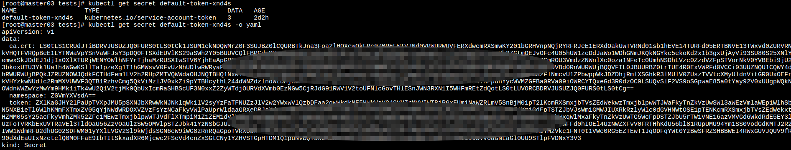

k8s配置
==================

> k8s的配置在k8s中主要是通过ConfigMap和Secret两种资源对象来实现. ConfigMap一般配置应用的配置文件, 环境变量信息. Secret一般配置密码信息, 并且支持多种类型. Secret的用法于ConfigMap用户是类似的, 下面主要对Secret做说明.  


## ConfigMap 

ConfigMap通过key, val键值对的方式保存配置信息. 

```yaml
apiVersion: v1
kind: ConfigMap
metadata:
  name: cm-test
data:
  key1: val1
  key2: val2
  map.hello: world
  appConfig: |
    APP_NAME=test
    APP_ENV=prod
  redisConf: |
    host=127.0.0.1
    port=3306
---
# env方式引入ConfigMap
apiVersion: v1
kind: Pod
metadata:
  name: cm-test
spec:
  containers:
  - name: test
    image: nginx:latest
    env:
    - name: key1
      valueFrom:
        configMapKeyRef:
          name: cm-test
          key: key1
    envFrom:
    - configMapRef:
        name: cm-test
---
# 数据卷的方式引入ConfigMap
apiVersion: v1
kind: Pod
metadata:
  name: cm-test2
spec:
  containers:
  - name: test
    image: nginx:latest
    volumeMounts:
    - name: cm
      mountPath: /etc/cm
  volumes:
  - name: cm
    configMap:
      name: cm-test
```
配置信息在data属性下进行配置. data中既支持键值对(key1, key2)的配置, 也支持文件类型配置(appConf, redisConf). 

## Secret 

k8s中Secret主要有三种类型: Opaque, dockerconfigjson, service account token.

- Opaque
  base64 encode方式编码, 存储密码(鸡肋). Opaque Secret使用跟ConfigMap类似. 
  ```yaml  
  # Opaque使用
  apiVersion: v1
  kind: Secret
  metadata:
    name: secret-test
  type: Opaque
  data:
    username: aGVsbG8= # echo -n "hello" | base64  
    password: d29ybGQ= # echo -n "aGVsbG8=" | base64 -d  
  ```
  

  

  ```yaml
  # volume挂载
  apiVersion: v1
  kind: Pod
  metadata:
    name: secret-test
  spec:
    containers:
    - name: test
      image: nginx:latest
      volumeMounts:
      - name: secret
        mountPath: /etc/secrets
    volumes:
    - name: secret
      secret:
        secretName: secret-test
  ```
    
  通过volume挂载的方式有一个好处, secrets改变容器中的也对应发生改变(截图中可以看出username, password都是直接挂载于data目录, data目录跟secret直接关联).

  ```yaml
  # 环境变量
  apiVersion: v1
  kind: Pod
  metadata:
    name: secret-test-2
  spec:
    containers:
    - name: test
      image: nginx:latest
      env:
      - name: username
        valueFrom:
          secretKeyRef:
            name: secret-test
            key: username
      envFrom:
      - secretRef:
          name: secret-test
  ```
  
  
- dockerconfigjson
  存储docker registy认证信息(私有仓库, 拉取镜像用, 通过imagePullSecrets使用). 
  ```bash
  DOCKER_SERVER=
  DOCKER_USER=
  DOCKER_PASSWORD=
  DOCKER_EMAIL=
  kubectl create secret docker-registry dockerregister \
  --docker-server=${DOCKER_SERVER} \
  --docker-username=${DOCKER_USER} \
  --docker-password=${DOCKER_PASSWORD} \
  --docker-email=${DOCKER_EMAIL}
  ```
  
- service account token
  在创建Service Account时, 会自动默认创建一个Secret对象. Pod使用了Service Account时, Secret会自动挂载到/run/secrets/kubernetes.io/serviceaccount目录中. 

  
   
  

  将defualt-token-xnd4s中的ca.crt, token经过base64 decode会发现与容器中/run/secrets/kubernetes.io/serviceaccount目录下的token, ca.crt是一致的. 

## 两种配置的异同点

- 相同点
  - 都是键值对
  - 都可以通过env/envFrom方式使用,将配置注入到env环境变量中
  - 都可以通过volumes的方式挂载到容器的某个目录中, 并且支持热更新
- 不同点
  - secret支持三种类型的Secret

