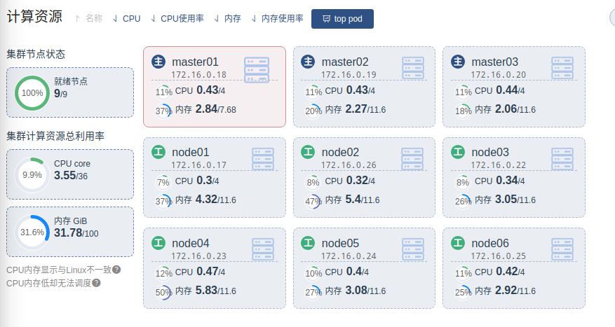
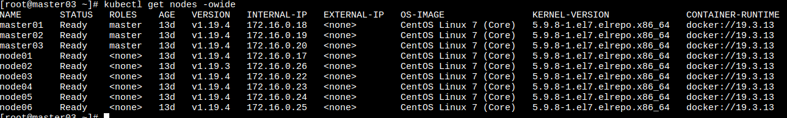

搭建高可用集群
===================

## 节点资源说明



## 配置keepalived 

在master01/master02/master03上安装keepalived, 设置master02的权重为100, 其他master为90. vip 为172.16.0.32. 当master02宕机时, vip会自动漂移到master01和master03. 
keepalived配置
```bash
LVS_NOTIF_EMAIL_TO=sd4413@163.com
LVS_NOTIF_EMAIL_FROM=594909494@qq.com
LVS_EMAIL_SMTP_SERVER=127.0.0.1
LVS_ROUTER_ID=srv01
LVS_STATE=MASTER
#LVS_STATE=BACKUP
LVS_PRIORITY=100
#LVS_PRIORITY=90
LVS_INTERFACE=eth0
LVS_AUTH_PASS=kubernetes
LVS_BRD_ADDR=172.16.0.255
LVS_IP_CIDR=172.16.0.32/24
cat > /etc/keepalived/keepalived.conf <<EOF
global_defs {
   notification_email {
     ${LVS_NOTIF_EMAIL_TO}
   }
   notification_email_from ${LVS_NOTIF_EMAIL_FROM}
   smtp_server ${LVS_EMAIL_SMTP_SERVER}
   smtp_connect_timeout 30
   router_id ${LVS_ROUTER_ID}
}
vrrp_instance VI_1 {
    state ${LVS_STATE}
    interface ${LVS_INTERFACE}
    virtual_router_id 51
    priority ${LVS_PRIORITY}
    advert_int 1
    authentication {
        auth_type PASS
        auth_pass ${LVS_AUTH_PASS}
    }
    virtual_ipaddress {
        ${LVS_IP_CIDR} brd ${LVS_BRD_ADDR} dev ${LVS_INTERFACE} label ${LVS_INTERFACE}:0
    }
    preempt delay 60
}
EOF
```
## 配置nginx

在master01, master02, master03上配置nginx 反向代理k8s kube-api server

```bash
user nginx;
worker_processes auto;
error_log /var/log/nginx/error.log;
pid /run/nginx.pid;
include /usr/share/nginx/modules/*.conf;
events {
    worker_connections 1024;
}
stream {
    upstream k8s-api-server {
        server 172.16.0.19:6443 weight=2;
        server 172.16.0.20:6443 weight=3;
        server 172.16.0.18:6443 weight=5;
    }
    server {
        listen 9443;
        proxy_connect_timeout 1s;
        proxy_pass k8s-api-server;
    }
}
```

## 初始化k8s集群

```bash
HOST_NAME=master02
KUBE_LOCAL_IP=xxxxxx
KUBE_API_PORT=6443


# apiserver vip, keepalived的VIP, 端口是nginx的9443端口
KUBE_API_VIP=xxxxxx:9443

# 安装版本&镜像下载地址
KUBE_VERSION=v1.19.3
IMAGE_REPOSITORY=registry.aliyuncs.com/google_containers

cat > "./kubeadm.yaml" <<EOF
apiVersion: kubeadm.k8s.io/v1beta2
kind: InitConfiguration
localAPIEndpoint:
  advertiseAddress: ${KUBE_LOCAL_IP}
  bindPort: ${KUBE_API_PORT}
nodeRegistration:
  criSocket: /var/run/dockershim.sock
  name: ${HOST_NAME}
  taints:
    - effect: NoSchedule
      key: node-role.kubernetes.io/master
---
apiServer:
  timeoutForControlPlane: 4m0s
apiVersion: kubeadm.k8s.io/v1beta2
certificatesDir: /etc/kubernetes/pki
clusterName: kubernetes
controllerManager: {}
dns:
  type: CoreDNS
etcd:
  local:
    dataDir: /data/k8s/etcd
kind: ClusterConfiguration
kubernetesVersion: ${KUBE_VERSION}
controlPlaneEndpoint: ${KUBE_API_VIP}
networking:
  podSubnet: 10.244.0.0/16
  serviceSubnet: 10.96.0.0/12
  dnsDomain: cluster.local
scheduler: {}
imageRepository: "${IMAGE_REPOSITORY}"
---
apiVersion: kubeproxy.config.k8s.io/v1alpha1
kind: KubeProxyConfiguration
mode: ipvs
EOF


kubeadm init --config "./kubeadm.yaml" \
--upload-certs \
--ignore-preflight-errors=NumCPU

# 初始化配置相关
mkdir -p $HOME/.kube
cp -i /etc/kubernetes/admin.conf $HOME/.kube/config
chown $(id -u):$(id -g) $HOME/.kube/config

kubeadm join xxxx:9443 --token 4ugw22.dyeqyxxxxxxxxxxxxxxxx \
    --discovery-token-ca-cert-hash sha256:1c07aa52f97637f2ae46b05b27f97xxxxxxxxxxxxxxxxxxxxxxxxxx \
    --control-plane --certificate-key dd4d875942f71be92de07cdfbca6093c4xxxxxxxxxxxxxxxxxxxx

Please note that the certificate-key gives access to cluster sensitive data, keep it secret!
As a safeguard, uploaded-certs will be deleted in two hours; If necessary, you can use
"kubeadm init phase upload-certs --upload-certs" to reload certs afterward.

Then you can join any number of worker nodes by running the following on each as root:

kubeadm join 172.16.0.32:9443 --token 4ugw22.dxxxxxxxxxxxxxxxxxxxxxxx \
    --discovery-token-ca-cert-hash sha256:1c07aa52f97637f2ae46b05b27f978cxxxxxxxxxxxxxxxxxxxxxxxx
```

## 其他master加入集群

```bash
kubeadm join xxxx:9443 --token 4ugw22.dyeqyxxxxxxxxxxxxxxxx \
    --discovery-token-ca-cert-hash sha256:1c07aa52f97637f2ae46b05b27f97xxxxxxxxxxxxxxxxxxxxxxxxxx \
    --control-plane --certificate-key dd4d875942f71be92de07cdfbca6093c4xxxxxxxxxxxxxxxxxxxx
```

## 其他节点加入集群

```bash
kubeadm join 172.16.0.32:9443 --token 4ugw22.dxxxxxxxxxxxxxxxxxxxxxxx \
    --discovery-token-ca-cert-hash sha256:1c07aa52f97637f2ae46b05b27f978cxxxxxxxxxxxxxxxxxxxxxxxx
```

