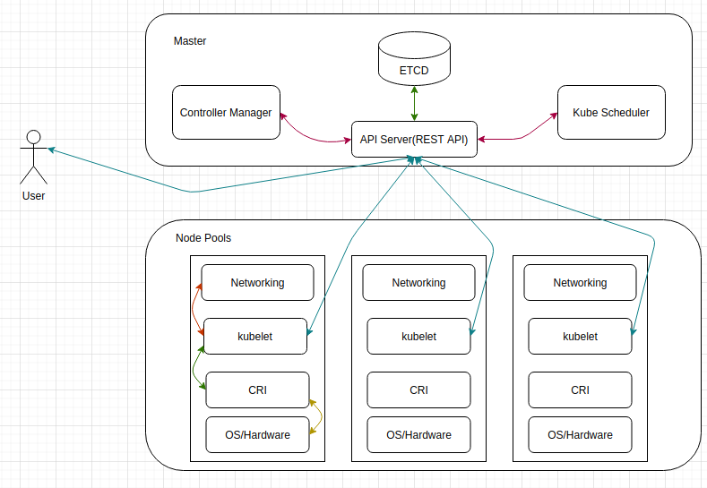

k8s是什么?
===================

> k8s是一个容器编排平台, 提供丰富的api支持容器编排, 通过这些api来定义服务的最终状态, k8s自动帮助系统达到和维持这个状态, 是CNCF(Cloud Native Computing Foundation)最重要的组件之一, 是云原声的基石. 

## k8s的几个特性

- 自愈能力  
  在节点不可用时, 会将pod迁移到其他可用节点, 保证业务的高可用.  

- 弹性伸缩能力  
  具备横向(HPA)和纵向(VPA)伸缩能力, 目前两者不能同时配置.  

- 服务发现和负载均衡  
  Pod具有生命周期(发布,升级,销毁,重建), k8s的服务发现为Pod提供统一的访问接口和负载均衡(Service). 

- 发布(滚动升级)和回滚  
  依赖于k8s控制器(Deployment)实现滚动升级和回滚. 

- 配置管理  
  主要是方便一些可变配置和容器进行解耦, 保证了容器的可移植性. 

- 存储管理  
  也是方便存储与计算分离, 保证了业务的高可用. 存储系统可以是本地存储(local storage), 网络存储(nfs, ceph).

## k8s架构

**k8s核心组件**

| 组件名称 | 简单介绍 |
| --- | --- |
| etcd | 保存集群的状态 |
| API Server | 操作资源的唯一入口, 只有apiserver才能直接操作etcd, 其他组件与apiserver交互 |
| kube controller manager | 负责维护集群状态,实现k8s集群故障检测和恢复的自动化工作, 保证集群始终处于预期的工作状态|
| kube scheduler | 负责集群的资源调度, 收集分析所有节点的资源负载情况, 能够将新建的pod放到正确的node节点 |
| kubelet |负责容器运行的组件, 负责node节点上 pod的创建, 修改, 删除, 监控, 节点情况上报|
| kube-proxy|管理service的入口, kube proxy管理service的endpoints |
| kubectl | k8s集群管理的命令行工具|

**架构示意图**



## k8s各个组件介绍
- API Server   
  API Server提供了资源对象(etcd)唯一的操作入口, Api Server封装了核心对象的CURD操作, 并通过Restful API风格提供外部客户端/组件调用. 如上图所示, 其他组件(schedule, controller manager, kubelet)都只能与API Server通信. 这样其他的组件只依赖于API Server而不会依赖etcd(像k3s, 边缘计算中不是用etcd作为后端的存储). 
  
- kube controller manager  
  controller manager 的作用是维护集群的状态, 并保证集群始终处于预期的工作状态. controller manager 负责执行各种控制器.
  - Replication Controller  
    副本控制器的作用是保证RC关联的POD与其设置值(ReplicaCount)保持一致.  
  - Node Controller  
    node controller的作用是通过api server实时获取node的相关信息. 实现监控和管理集群中各个节点的作用.
  - ResourceQuota Controller  
    资源配额控制器用于确保资源对象在任何时候都不会超量的占用系统上的物理资源.
  - Namespace Controller  
    命名空间控制器的作用处理命名空间的增删查改, 在删除时, 还需要清理空间下的各个资源. 
  - Service Account Controller  
    服务账号控制器, 主要是管理命名空间内的service account. 
  - Token Controller  
    监听service account/secret的创建和删除事件.  
  - Service Controller  
    监听service的变化. Service 有NodePort, LoadBalancer, ClusterIP三种类型. 
  - Endpoints Controller  
    endpoints表示一个service对应的所有POD的访问地址, endpoints controller负责生成和维护endpoints对象. 比如滚动更新的时候, pod的ip不断变化, endpoints controller监听service 和 pod的变化, 最终保证service到pod的映射关系是最新的.
  - Deployment Controller
  - ReplicaSet Controller
  - StatefulSet Controller
  - DaemonSet Controller
  - Job Controller
  - CronJob Controller 
  - HPA Controller

- kube schedule  
  Schedule负责整个集群的资源调度, 主要是汇总当前集群的资源负载情况, 根据资源负载情况, 将新建的POD分配到合适的节点上. POD分配到节点后, 将POD的信息通过API Server写回etcd. 

- kubelet
  - 通过CRI与Docker进行交互，负责容器运行的组件, 负责各个节点上pod的创建, 修改, 监控, 删除(POD的生命周期)。
  - 通过CNI调用网络插件为容器配置网络。
  - 通过CSI调用存储插件为容器配置持久化存储。 
  - 定时上报各个节点的状态给API Server。
  - 通过API Server接受Master分配任务, 并执行任务。

- kube-proxy
  每个k8s集群节点上都运行着kube-proxy进程, 负责实现k8s中的service的vip服务. kube-proxy有[三种工作模式](https://www.lagou.com/lgeduarticle/107089.html): User space模式, Iptables 模式, IPVS模式. 
  - User space模式  
    kube-proxy通过监听API Service观察service和endpoints对象的变化, 当有新的service创建时, 所有节点的kube-proxy在node节点上随机选择一个端口, 在iptables中追加一条把访问service的请求重定向到这个端口的记录,并开始监听这个端口的连接请求. 
    ```bash
    # 创建了一个service(vip: 192.168.0.1 port: 80), kube-proxy在node节点上随机选择一个端口32380, 然后会追加两条iptables
    -A PREROUTING -j KUBE-PORTALS-CONTAINER
    -A KUBE-PORTALS-CONTAINER -d 192.168.0.1/32 -p tcp --dport 80 -j REDIRECT --to-ports 32380

    COPY FROM https://www.lagou.com/lgeduarticle/107089.html
    ```
    这样当有请求访问这个servie的时候, 在PREROUTING阶段, 将这个请求jump到KUBE-PORTALS-CONTAINER这条规则, 这个规则会把请求重定向到kube-proxy监听的32380端口. 数据包进入到kube-proxy进程后, kube-proxy根据service 和 endpoints 选择一个POD来服务这个请求.  
  - Iptables 模式(默认模式)  
    kube-proxy通过监听API Server观察service和endpints对象的变化, 当存在Service创建时, kube-proxy在iptables中追加新的规则. 对于service的每个endpoint,会在iptables中追加一条规则, 设定动作为DNAT, 将目的地址设置为真正提供服务网的pod地址, 再为service追加规则, 设定动作为跳转到对应的endpoint的规则上. 

    创建了一个service，对应的IP：192.168.0.1,port:80，对应一个后端地址：10.1.0.8:8080
    ```bash
    -A PREROUTING -j KUBE-SERVICES
    -A KUBE-SERVICES -d 192.168.0.1/32 -p tcp –dport 80 -j KUBE-SVC-testxxx
    -A KUBE-SVC-testxxx -j KUBE-SEP-podxxxx
    -A KUBE-SEP-podxxxx -p tcp -j DNAT –to-destination 10.1.0.8:8080

    COPY FROM https://www.lagou.com/lgeduarticle/107089.html
    ```
    这种模式下, 数据转发都在系统内核层面做, 提升了性能. 但在这个模式下存在一个问题,如果选中一个异常的pod, 请求会失败, userspace模式下, 请求失败后kube-proxy还能对其他endpoint进行重试. 基于此, 我们的应用需要提供readness/liveness能力, kube-proxy只会将通过readness/liveness的pod写入到iptables规则中,避免将请求转发到不正常的pod中.  
  - IPVS模式  
    Iptables模式下, kube-proxy需要为每一个service和每一个endpoint生成相应的iptables规则, 当服务规模很大时,性能会显著下降. 在IPVS模式下, kube-proxy监听API Server观察Service和Endpoint对象的变化, 通过调用netlink接口创建相应的IPVS规则, 并周期性的对k8s的Service, endpoint和IPVS规则进行同步,当访问一个Service时, IPVS负责选择一个真实的POD来提供服务. 
  - Cilium(eBPF)  
    待定
- kubectl  
  kubectl是一个客户端cli工具, 通过对API Server进行操作, 达到管理k8s集群的作用. 