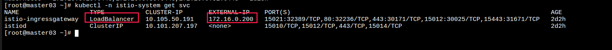

k8s网络
=================

## 外部流量导入集群

##### loadbalancer
```yaml
#!/usr/bin/env bash
curl -o metallb.yaml -Ssl  https://raw.githubusercontent.com/metallb/metallb/v0.9.5/manifests/metallb.yaml
kubectl create namespace metallb-system
kubectl create secret generic -n metallb-system memberlist --from-literal=secretkey="$(openssl rand -base64 128)"
cat > metallb-config.yaml <<EOF
apiVersion: v1
kind: ConfigMap
metadata:
  namespace: metallb-system
  name: config
data:
  config: |
    address-pools:
    - name: default
      protocol: layer2
      addresses:
      - 172.16.0.200-172.16.0.240
EOF
kubectl -n metallb-system  apply -f metallb-config.yaml
kubectl -n metallb-system apply -f metallb.yaml
```
一般公有云提供了负载均衡器, 通过负载均衡器IP, 将流量转发到k8s集群内的Service上. 私有集群, 可以通过metallb插件实现loadbalancer. 


##### NodePort
在k8s节点上监听某个端口(可以指定, 不指定会随机分配一个端口), 外部流量通过这个端口进入到集群内部. 

```yaml
apiVersion: v1
kind: Service
metadata:
  name: nodeport-service
spec:
  selector:
    app: nodeport-app
  type: NodePort
  ports:
  - protocol: TCP
    port: 80
    targetPort: 80
    nodePort: 30093
    name: http
```


nodePort端口范围可以通过修改kube-apiserver.yaml中的--service-node-port-range=1-65535来自定义. 

## Service
k8s集群是一个跨节点的集群. k8s的上pod之前通信是跨节点. 而且pod是有生命周期的, 每个pod都有自己的IP地址. 随着每次发布新的应用(deployment), 旧的pod被新的pod替换. 在这个过程中, pod的IP也在替换. 
k8s服务之间通过Service来访问后端服务, Service是Pod的逻辑分组. 每个Service对象在k8s中有一个同名的endpints对象.

endpoints记录着service(通过label selector匹配)对应所有的pod地址.

## kube-proxy

我搭建的集群, 没有启用原生的kube-proxy, 而是使用cilium替换了kube-proxy组件, cilium在未来将会替换kube-proxy. 目前主流的k8s集群还是使用原生的kube-proxy组件. kube-proxy有三种模式: User space模式(现在基本也不使用了), iptables模式, ipvs模式. kube-proxy会在每个节点上运行(kubeadm 中以daemonset 静态pod方式运行). 

- iptables 
  在iptables模式下, kube-proxy通过监听API Service中Service和endpoints对象的变化, 调整iptables规则(DNAT模式). iptables模式下, 每个servie 都会跟一个endpoint建立一个规则. 
  iptables可以通过 -m recent模式实现session affinity, 通过-m statistic模式实现负载均衡权重功能. 

- ipvs
  ipvs 是基于netfilter的hook功能, 用内核的hash表最为存储结构, 在大规模服务的时候, 不像iptables模式规则越来越多性能低下. IPVS在后端服务的选择上提供了: rr, lc(最小连接数), dh(目的hash), sh(原地址hash), sed(最短延时)多种算法.


## cilium
  后面重点关注. 