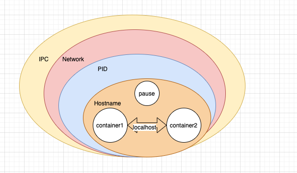

Pod是什么?
=====================

> Pod是一组容器集合, Pod中的容器共享IPC/PID/Network/Namespace, 是k8s调度的基本单位. 

## Pod实现原理

Pod是基于Linux容器的Namespace隔离技术和Cgroup技术实现的. Linux内核支持IPC, Network, Mount, PID, User, UTS 这六种隔离技术。Pod中的所有容器都共享一个Namespace。 

- [Cgroup](https://zh.wikipedia.org/wiki/Cgroups)  
  全称“资源自控制群组”, 是linux用来限制，控制与分离一个进程组群的资源（CPU, Memory, 磁盘输入输出）. Cgroup是一种控制手段，对于计算机来说，资源大概分为计算资源/内存资源/io资源/网络资源四个部分（学习linux内核，也是从这四个部分入手）。
- IPC Namespace  
  IPC namespace实现了不同namespace的进程组之间实现通信隔离。无法通过消息队列，共享内存，信号量的方式通信。 
- Network Namespace  
  不同namespace之间都有自己独立的网络设备，IP，路由表，/proc/net目录，端口号等。网络隔离可以保证独立使用网络资源。  
- Mount Namespace  
  隔离文件挂载点， 每个进程都能看到的文件系统都记录在/proc/$$/mounts里。在namespace里挂载，都不会影响到其他namespace。  
- Pid Namespace  
  不同的namespace的进程在自己namespace中使用相同的进程号。
- User Namespace  
  隔离用户和用户组。可以让宿主机的普通用户在namespace里称为0号用户(root)。
- UTS Namespace  
  对主机名和域名进行隔离。

#### pause容器(infrastucture container)

Pod中存在一个叫做infra容器(k8s.gcr.io/pause:3.1)，这个infra容器永远是最先被创建的，Pod中的其他容器在运行时通过 *--net=container:pause --ipc=container:pause --pid=container:pause --uts=container:pause* 加入到同一个Namespace。这些容器组共同组成一个Pod。

## Pod的生命周期

**Pod状态**

Pod有一个Status属性，是一个PodStatus对象， 这个对象拥有phase字段，PodCondition数组。  

| phase| 说明 |
| --- | --- | 
| Pending | Pod创建信息已经提交到k8s, 但是还没有创建容器。这个阶段主要是下载镜像 |
| Running | Pod已经绑定到节点上，镜像已经下载，Pod已经创建, 至少存在一个容器处于正在运行，运行，或重启启动的状态 |
| Succeeded | 所有容器成功终止，也不会重启 |
| Failed | 容器以非0状态退出 |
| Unknown | 由于一些原因，Pod状态无法获取 | 

| PodCondition| 说明| 
| --- | --- |
| lastProbeTime| 最后一次探测Pod Condition时间戳 |
| lastTransitionTime | 上次Condition状态转换时间 | 
| message | 上次condition最后一次转换描述 | 
| reason | 最后一次转换原因 | 
| status | true, false, unknown 三种状态 |
| type | PodScheduled（pod调度到node节点）, Ready（Pod能够提供服务）, Initialized(initContainers启动成功), UnSchedulable（无法调度Pod）, ContainersReady(容器处于ready状态) | 

Pod type中Ready和ContainersReady状态：Ready是指Pod能够完全提供服务（readness/liveness正常)； ContainersReady是指Pod中的所有container已经Ready，但是还没有通过readness/liveness探针检测。

**Pod生命周期**

Pod生命周期主要是两个阶段，第一个是init containers阶段，第二个是主容器运行阶段。 

- init containers  
  init containers是初始化容器。是一个容器数组，会依次顺序执行。Pod中所有的容器都在同一个Namespace中。init containers的主要作用就是初始化资源，解决当前pod与其他服务的依赖问题(当前Pod依赖其他服务的时候，可以在init containers中去检查其他服务是否准备好)。
- main containers
  - post start hook  
    Pod中容器创建后立即执行（非阻塞）。 
  - liveness probe  
    存活探针，检测应用程序是否正在运行。
  - readness probe  
    可读性探针，检测应用是否可以提供服务。
  - pre stop hook  
    容器终止之前立即执行（阻塞）。

## Pod在k8s中创建流程

1. 创建POD
   - 写一个yaml文件, 通过kubectl创建一个Pod. 会把yaml文件转换为Pod对象提交给API Server. 
   - API Server把Pod对象写入到etcd存储中.
2. kube scheduler 通过API Server监听到了Pod创建事件
   - 汇总当前k8s集群中所有node节点的负载情况
   - 计算Pod适合调度到哪个node节点
   - 将最合适调度的node节点提交给API Server
   - API Server将node节点绑定到Pod对象, 写入到etcd
3. kubelet通过API Server监听Pod绑定节点事件
   - kubelet获取pod对象信息
   - kubelet通过CRI运行Pod
   - kubelet将Pod运行信息提交给API Server
   - API Server更新pod状态到etcd