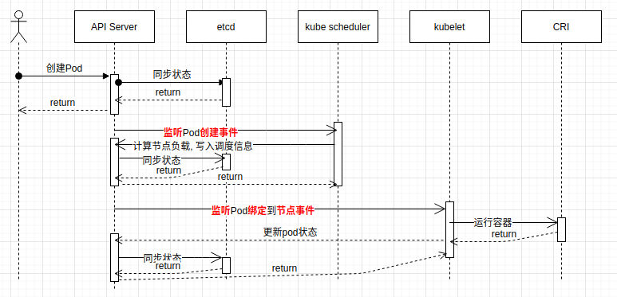

Pod是什么?
=====================

> Pod是一组容器集合, Pod中的容器共享IPC/PID/Network/Namespace, 是k8s调度的基本单位. 

## POD创建流程

1. 创建POD
   - 写一个yaml文件, 通过kubectl创建一个Pod. 会把yaml文件转换为Pod对象提交给API Server. 
   - API Server把Pod对象写入到etcd存储中.
2. kube scheduler 通过API Server监听到了Pod创建事件
   - 汇总当前k8s集群中所有node节点的负载情况
   - 计算Pod适合调度到哪个node节点
   - 将最合适调度的node节点提交给API Server
   - API Server将node节点绑定到Pod对象, 写入到etcd
3. kubelet通过API Server监听Pod绑定节点事件
   - kubelet获取pod对象信息
   - kubelet通过CRI运行Pod
   - kubelet将Pod运行信息提交给API Server
   - API Server更新pod状态到etcd