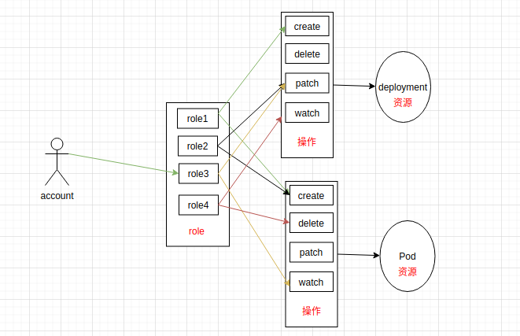
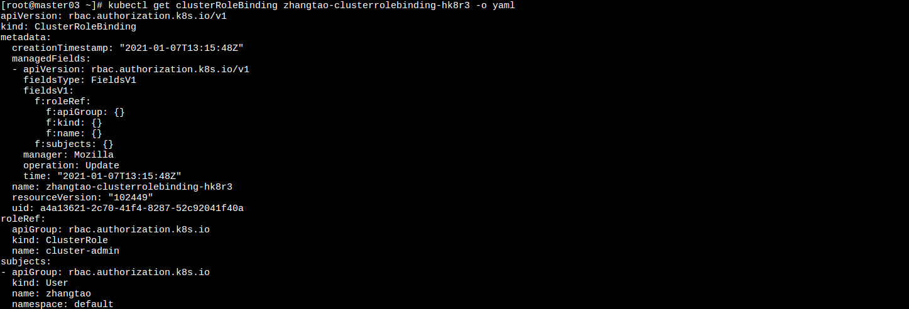
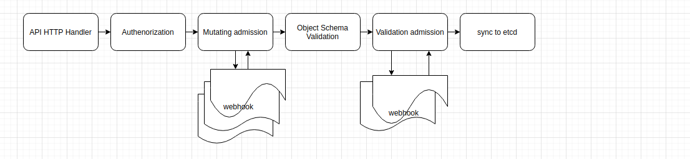

k8s安全
===============

> k8s安全, 主要从三个方面介绍k8s. 第一个是k8s内部鉴权方式(rbac), 第二个是是pod/容器的安全管控(securityContext), 最后一个是准入控制器. 

## 内部鉴权

k8s 将资源对象通过API Server以Restful API对象的方式暴露出来. 例如k8s中有 Nodes, Namespaces, Pods, Deployments, Secrets, ConfigMaps等常用资源, 这些资源的操作有Create, Get, Delete, List, Update, Edit, Exec, Patch, Watch(Restful API). k8s中使用rbac的方式做鉴权. rbac是将用户与角色关联, 角色可以配置对资源的操作权限, 然后再通过对用户赋予角色而得到这些角色的权限. 



在k8s中需要了解以下几个概念

- Rule  
  Rule 就是资源的操作的集合(create, get ,delete, list, update, edit, exec, patch, watch ...). 
- Role/ClusterRole  
  Role是配置单个namespace, ClusterRole是对整个k8s集群. Role中包含资源的部分Rule, 表示这个role具备操作资源的某些权限.
    ```yaml
    apiVersion: rbac.authorization.k8s.io/v1
    kind: ClusterRole
    metadata:
      annotations:
        rbac.authorization.kubernetes.io/autoupdate: "true"
      labels:
        kubernetes.io/bootstrapping: rbac-defaults
    name: cluster-admin # 具有集群的最高权限
    rules:
    - apiGroups: # 资源组(*表示所有组)
      - '*'
      resources: # 表示所有的对象
      - '*'
      verbs: # 表示具有所有的操作(权限)
      - '*'
    ---
    apiVersion: rbac.authorization.k8s.io/v1
    kind: Role
    metadata:
      name: test-role
    rules:
    - apiGroups: ["apps"] # 资源组
      resources: ["deployment", "pods"] # 资源
      verbs: ["get", "list", "watch", "delete"] # 资源操作(权限)
    ```
- Subject  
  授权对象, 主要有三种
  - User Account  
    用户账号(用于外部). 
  - Group  
    组可以关联多个账号(用于外部).
  - Service Account  
    服务账号, 与namespace关联(用于内部), k8s中创建namespace会自动生成一个default的serviceaccount.
- RoleBinding/ClusterRoleBinding
  将Subject 与 Role/ClusterRole进行绑定. 


将Subect(User:zhangtao)与ClusterRole(cluster-admin)进行绑定. zhangtao这个用户是cluster-admin角色, 具有集群的最高权限. 

## Pod安全管控
  在使用docker run 的时候, 可以通过--privileged进行提权. 在k8s中, pod需要更高的权限就需要通过[Security Context](https://kubernetes.io/zh/docs/concepts/policy/pod-security-policy/)进行提权. 但是如果使用不当, 会造成权限过大, 可能会有安全隐患. 

```bash
kubectl explain Pod.spec.containers.securityContext
```

| 安全选项 | 选项类型 | 选项介绍 |
| --- | -- | --- |
| allowPrivilegeEscalation | bool | 控制进程是否可以获得超出其父进程的特权。| 
| [capabilities](https://docs.docker.com/engine/reference/run/#runtime-privilege-and-linux-capabilities) | object | 赋予容器 root 用户所拥有的某些特权。 |
| privileged | bool | 允许提权 |
| procMount | string | 指定容器可以挂载的 proc 类型	|
| readOnlyRootFilesystem | bool | 要求容器必须以只读方式挂载根文件系统来运行 （即不允许存在可写入层）|
| runAsGroup | integer | 制运行容器时使用的主用户组 ID |
| runAsNonRoot | bool | 要求容器通过 USER 指令给出非零的数值形式 的用户 ID |
| runAsUser | integer | 控制使用哪个用户 ID 来运行容器 |
| seLinuxOptions | object |针对 seLinuxOptions 所给值执行验证检查 |
| seccompProfile | object |seccompProfile, Kubernetes允许将加载到节点上的seccomp配置文件自动应用于Pod和容器 |


## 准入控制器

准入控制器是一段代码，它会在请求通过认证和授权之后、对象被持久化之前拦截到达 API 服务器的请求。在这个流程中存在两个控制器, MutatingAdmissionWebhook 和 ValidatingAdmissionWebhook。



- 准入控制器-变更阶段(Mutaing)  
  mutaing阶段, 准入控制器与webhook是串行调用. 用来对Request API Object修改. 
- 准入控制器-验证阶段(Validating)  
  validating阶段, 准入控制器与webhook是并行调用. 用来对Request API Object进行校验. 任何一个拒绝请求, 则当前请求失败. 