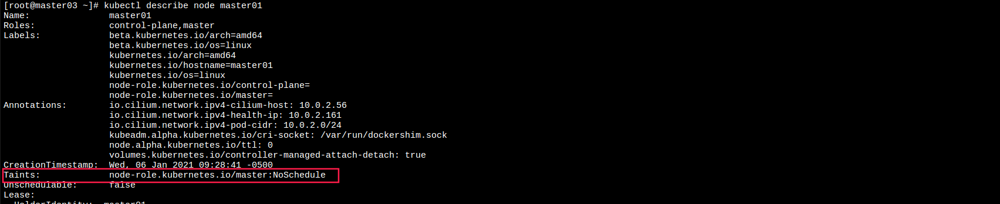

k8s调度器
========================

> kube-scheduler是k8s的核心组件之一, 负责整个集群资源的调度, 根据特定的算法和策略, 将pod调度到最合适的节点上, 以充分利用集群的资源. 

之前在[pod创建流程](https://www.taozhang.net.cn/#/k8s/pod_01?id=pod%e5%9c%a8k8s%e4%b8%ad%e5%88%9b%e5%bb%ba%e6%b5%81%e7%a8%8b)中已经介绍过了scheduler工作流程. 

kube scheduler 通过 API Server监听Pod.spec.nodeName的值, 如果是空值则会根据调度算法, 将pod调度到最优节点. 

  
## binding

绑定就是将pod调度到节点的过程. 调度器在k8s集群中找到该pod可调度的node节点列表, 然后根据一系列算法对这些节点进行打分, 最后选出得分最高的节点. 调度器将节点信息通过API Server写回etcd, 完成binding过程. 
在k8s 1.12(percentageOfNodesToscore)以后, 调度器在找到一定数量的可调度节点后, 就进行打分, 不再寻找所有可调度节点. 在大规模集群下, 会提高调度性能. 在k8s 1.14版本后, 调度器根据集群规模自动设置了一个比例. 这个比例是根据线性公式计算, 100个节点取50%, 5000个节点取10%, 最低值为5%. 低于50个节点, 依然会检查所有节点. 

## k8s调度框架

[这部分见其他文章](https://blog.csdn.net/yunqiinsight/article/details/103903712), 后面有时间再深入理解一下. 

## nodeSelector

nodeSelector可以把pod直接绑定到节点上. 一般pod需要使用local storage的时候, 通过这种方式将pod绑定到某个节点. 

## 节点亲和性

nodeAffinity是节点亲和性, nodeAffinity包含了nodeSelector的功能, nodeAffinity调度存在两种策略:
- preferredDuringSchedulingIgnoredDuringExecution(贼长, 根本记住不)
  偏好限制, 如果不满足, 那么pod依然能够继续调度. 满足了更好. 
- requiredDuringSchedulingIgnoredDuringExecution
  强制限制, 如果不满足, 那么pod调度就会失败

```yaml
apiVersion: apps/v1
kind: Deployment
metadata:
  name: nginx-node-affinity
  labels:
    app: nginx-node-affinity
spec:
  replicas: 3
  selector:
    matchLabels:
      app: nginx-node-affinity
  template:
    metadata:
      labels:
        app: nginx-node-affinity
    spec:
      containers:
      - name: nginx
        image: nginx:latest
        ports:
        - containerPort: 80
          name: nginx
      affinity:
        nodeAffinity:
          requiredDuringSchedulingIgnoredDuringExecution:  # 强制限制, 就不断重试, 知道满足条件为止. 
            nodeSelectorTerms:
            - matchExpressions:
              - key: kubernetes.io/hostname
                operator: NotIn
                values:
                - node02
          preferredDuringSchedulingIgnoredDuringExecution:  # 偏好限制, 如果能满足, 就调度. 如果不满足就忽略当前条件. 
          - weight: 1
            preference:
              matchExpressions:
              - key: kubernetes.io/hostname
                operator: In
                values:
                - node01
```
## pod亲和性/反亲和性

pod亲和性/反亲和性主要是解决哪些pod能够在一个拓扑域(多k8s集群架构), 哪些不能够在一个拓扑域. podAffinity和podUntiAffinity跟nodeAffinity一样, 都具有两种策略. 

## 污点和容忍

污点(taints)与nodeAffinity相反, 表示pod不会被调度到具有taints的节点上. kubeadm部署的K8s集群, master节点都具有node-role.kubernetes.io/master:NoSchedule的污点. 容忍表示pod可以容忍这个污点. 



```bash
# 打污点命令 
kubectl taints nodes ${NODE} node-role/kubernetes.io/ceph-rook:NoSchedule
# 移除污点
kubectl taints nodes ${NODE} node-role/kubernetes.io/ceph-rook-
```
| effect | 影响范围 |
| --- | --- | 
| NoSchedule | 表示新的Pod不会调度到该节点上|
| PreferNoSchedule | 表示新的Pod尽量不要调度到该节点上|
| NoExecute| 表示没有设置容忍的Pod都要驱逐出去|

```yaml
# pod 容忍申明
tolerations:
- key: "node-role.kubernetes.io/master"
  operator: "Exists"
  effect: "NoSchedule"
```

| 参数| 说明 |
| --- | --- |
| key | 污点key |
| operator| Exists/Equal |
| effect | NoSchedule/PreferNoSchedule/NoExecute | 


