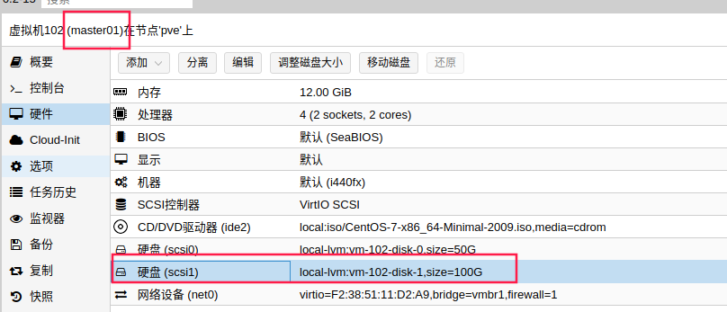
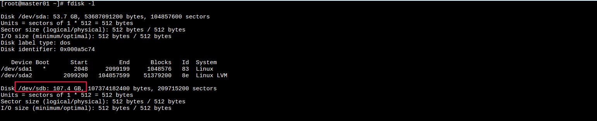
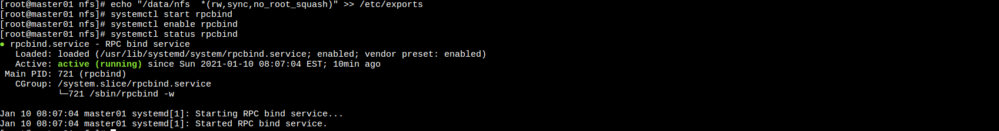
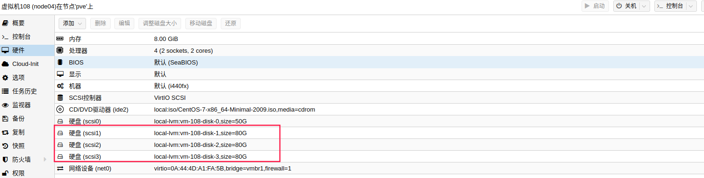
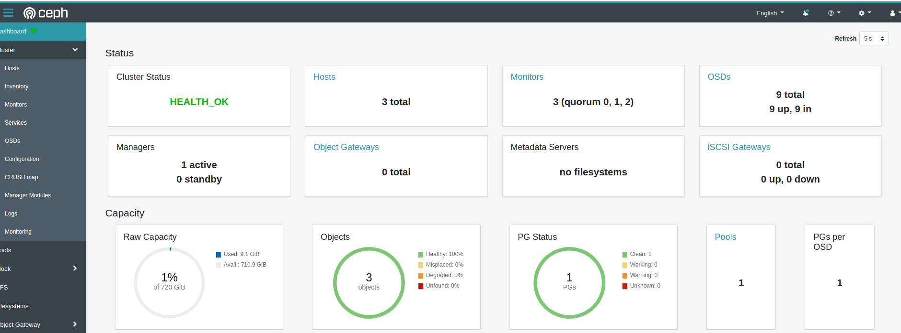
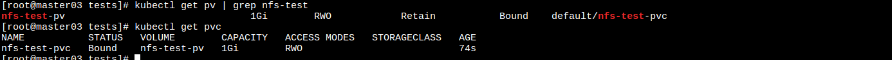

k8s存储应用
====================

> 在平时使用过程中, 主要使用了hostPath, nfs, ceph三种存储. 官方支持多种[存储类型](https://kubernetes.io/zh/docs/concepts/storage/volumes/#volume-types). 

## nfs

nfs服务, 直接本机搭建即可. 给master01上分配一块100G的磁盘用来提供nfs服务. 


```bash
# 安装nfs Server
yum -y install nfs-utils rpcbind
# 挂载硬盘
mkfs.ext4 /dev/sdb
mkdir -p /data/nfs
mount /dev/sdb /data/nfs
echo "/dev/sdb /data/nfs  ext4  defaults  0 0" >>/etc/fstab
# 配置nfs Server
echo "/data/nfs  *(rw,sync,no_root_squash)" >> /etc/exports
systemctl start rpcbind
systemctl enable rpcbind
systemctl status rpcbind
```


## ceph
之前使用过外部ceph存储(通过嵌套虚拟化使用proxmox组成ceph超融合方案), 但是嵌套虚拟化性能较差, 现在的k8s集群是直接在proxmox上通过虚拟机搭建的. ceph集群是基于[rook-ceph](https://rook.github.io/docs/rook/master)搭建的. 

为node04/node05/node06各分配3*80G硬盘. 


```bash
# 安装
kubectl apply -f https://raw.githubusercontent.com/rook/rook/master/cluster/examples/kubernetes/ceph/common.yaml
kubectl apply -f https://raw.githubusercontent.com/rook/rook/master/cluster/examples/kubernetes/ceph/crds.yaml
kubectl apply -f https://raw.githubusercontent.com/rook/rook/master/cluster/examples/kubernetes/ceph/operator.yaml
```
[ceph配置](https://raw.githubusercontent.com/rook/rook/master/cluster/examples/kubernetes/ceph/cluster.yaml), 配置要挂载的裸盘. 下面是主要配置. 
```yaml
...
  storage: # cluster level storage configuration and selection
    useAllNodes: false
    useAllDevices: false
    #deviceFilter:
    config:
      # crushRoot: "custom-root" # specify a non-default root label for the CRUSH map
      # metadataDevice: "md0" # specify a non-rotational storage so ceph-volume will use it as block db device of bluestore.
      # databaseSizeMB: "1024" # uncomment if the disks are smaller than 100 GB
      # journalSizeMB: "1024"  # uncomment if the disks are 20 GB or smaller
      # osdsPerDevice: "1" # this value can be overridden at the node or device level
      # encryptedDevice: "true" # the default value for this option is "false"
# Individual nodes and their config can be specified as well, but 'useAllNodes' above must be set to false. Then, only the named
# nodes below will be used as storage resources.  Each node's 'name' field should match their 'kubernetes.io/hostname' label.
    nodes:
    - name: "node04"
      devices:
      - name: "sdb"
      - name: "sdc"
      - name: "sdd"
    - name: "node05"
      devices:
      - name: "sdb"
      - name: "sdc"
      - name: "sdd"
    - name: "node06"
      devices:
      - name: "sdb"
      - name: "sdc"
      - name: "sdd"
...
```

## k8s应用存储
- pv  
  pv全称为PersistentVolume(持久化卷), 是对底层共享存储的一种抽象, pv支持多种共享存储(local, nfs, ceph, glusterfs等). 
  ```yaml
  apiVersion: v1
  kind: PersistentVolume
  metadata:
    name: nfs-test-pv
  spec:
    capacity:
      storage: 1Gi
    accessModes:
    - ReadWriteOnce
    persistentVolumeReclaimPolicy: Retain
    nfs:
      path: /data/nfs
      server: ${nfs_server_ip}
  ```
- pvc  
  全称PersistentVolumeClaim(持久化卷申明), k8s中存在一个专门处理pvc和pv绑定的控制器 Volume Controller. 这个控制器的作用之一就是用于绑定pvc和pv. VolumeController通过API Server监听pvc是否处于Bound状态, 如果不是就会遍历所有可用的Pv, 并尝试将其与未Bound的pvc进行绑定. 
  ```yaml
  # 申明pvc, 并绑定pv
  apiVersion: v1
  kind: PersistentVolumeClaim
  metadata:
    name: nfs-test-pvc
  spec:
    accessModes:
    - ReadWriteOnce
    resources:
      requests:
        storage: 1Gi
  ---
  # 使用pvc
  apiVersion: v1
  kind: Pod
  metadata:
    name: pod-test-pvc
  spec:
    volumes:
    - name: nfs
      persistentVolumeClaim:
        claimName: nfs-test-pvc
    containers:
    - name: nginx
      image: nginx:latest
      ports:
      - name: http
        containerPort: 80
      volumeMounts:
      - name: nfs
        subPath: test-nfs
        mountPath: "/usr/share/nginx/html"
  ```
  
- storageclass  
  动态存储(动态pv). 上面的方式需要手动的去创建pv, pvc, 所以称为静态pv. 动态pv则是通过程序(provisioner)去绑定pv. 
  - nfs 配置storageclass
    ```yaml
    kind: Deployment
    apiVersion: apps/v1
    metadata:
      name: nfs-client-provisioner
      namespace: nfs-storage
      labels:
        app: nfs-client-provisioner
    spec:
      replicas: 1
      strategy:
        type: Recreate
      selector:
        matchLabels:
          app: nfs-client-provisioner
      template:
        metadata:
          labels:
            app: nfs-client-provisioner
        spec:
          serviceAccountName: nfs-client-provisioner
          containers:
            - name: nfs-client-provisioner
              image: quay.io/external_storage/nfs-client-provisioner:latest
              volumeMounts:
                - name: nfs-client-root
                  mountPath: /persistentvolumes
              env:
                - name: PROVISIONER_NAME
                  value: fuseim.pri/nfs-storage
                - name: NFS_SERVER
                  value: ${NFS_SERVER_IP}
                - name: NFS_PATH
                  value: /data/nfs
          volumes:
            - name: nfs-client-root
              nfs:
                server: ${NFS_SERVER_IP}
                path: /data/nfs
    ---
    apiVersion: v1
    kind: ServiceAccount
    metadata:
      name: nfs-client-provisioner
    ---
    kind: ClusterRole
    apiVersion: rbac.authorization.k8s.io/v1
    metadata:
      name: nfs-client-provisioner-runner
      namespace: nfs-storage
    rules:
      - apiGroups: [""]
        resources: ["persistentvolumes"]
        verbs: ["get", "list", "watch", "create", "delete"]
      - apiGroups: [""]
        resources: ["persistentvolumeclaims"]
        verbs: ["get", "list", "watch", "update"]
      - apiGroups: ["storage.k8s.io"]
        resources: ["storageclasses"]
        verbs: ["get", "list", "watch"]
      - apiGroups: [""]
        resources: ["events"]
        verbs: ["list", "watch", "create", "update", "patch"]
      - apiGroups: [""]
        resources: ["endpoints"]
        verbs: ["create", "delete", "get", "list", "watch", "patch", "update"]

    ---
    kind: ClusterRoleBinding
    apiVersion: rbac.authorization.k8s.io/v1
    metadata:
      name: run-nfs-client-provisioner
      namespace: nfs-storage
    subjects:
      - kind: ServiceAccount
        name: nfs-client-provisioner
        namespace: nfs-storage
    roleRef:
      kind: ClusterRole
      name: nfs-client-provisioner-runner
      apiGroup: rbac.authorization.k8s.io
    ---
    apiVersion: storage.k8s.io/v1
    kind: StorageClass
    metadata:
      name: nfs-storage
    provisioner: fuseim.pri/nfs-storage
    ```


  - [ceph storageclass配置](https://rook.github.io/docs/rook/master/ceph-block.html)
    ```yaml
    apiVersion: ceph.rook.io/v1
    kind: CephBlockPool
    metadata:
      name: replicapool
      namespace: rook-ceph
    spec:
      failureDomain: host
      replicated:
        size: 3
    ---
    apiVersion: storage.k8s.io/v1
    kind: StorageClass
    metadata:
      name: rook-ceph-block
    # Change "rook-ceph" provisioner prefix to match the operator namespace if needed
    provisioner: rook-ceph.rbd.csi.ceph.com
    parameters:
        # clusterID is the namespace where the rook cluster is running
        clusterID: rook-ceph
        # Ceph pool into which the RBD image shall be created
        pool: replicapool

        # (optional) mapOptions is a comma-separated list of map options.
        # For krbd options refer
        # https://docs.ceph.com/docs/master/man/8/rbd/#kernel-rbd-krbd-options
        # For nbd options refer
        # https://docs.ceph.com/docs/master/man/8/rbd-nbd/#options
        # mapOptions: lock_on_read,queue_depth=1024

        # (optional) unmapOptions is a comma-separated list of unmap options.
        # For krbd options refer
        # https://docs.ceph.com/docs/master/man/8/rbd/#kernel-rbd-krbd-options
        # For nbd options refer
        # https://docs.ceph.com/docs/master/man/8/rbd-nbd/#options
        # unmapOptions: force

        # RBD image format. Defaults to "2".
        imageFormat: "2"

        # RBD image features. Available for imageFormat: "2". CSI RBD currently supports only `layering` feature.
        imageFeatures: layering

        # The secrets contain Ceph admin credentials.
        csi.storage.k8s.io/provisioner-secret-name: rook-csi-rbd-provisioner
        csi.storage.k8s.io/provisioner-secret-namespace: rook-ceph
        csi.storage.k8s.io/controller-expand-secret-name: rook-csi-rbd-provisioner
        csi.storage.k8s.io/controller-expand-secret-namespace: rook-ceph
        csi.storage.k8s.io/node-stage-secret-name: rook-csi-rbd-node
        csi.storage.k8s.io/node-stage-secret-namespace: rook-ceph

        # Specify the filesystem type of the volume. If not specified, csi-provisioner
        # will set default as `ext4`. Note that `xfs` is not recommended due to potential deadlock
        # in hyperconverged settings where the volume is mounted on the same node as the osds.
        csi.storage.k8s.io/fstype: ext4

    # Delete the rbd volume when a PVC is deleted
    reclaimPolicy: Delete
    ```

## hostPath
hostPath可以使用[rancher推出的一个组件](https://github.com/rancher/local-path-provisioner). 可以很方便的使用local pv. 


