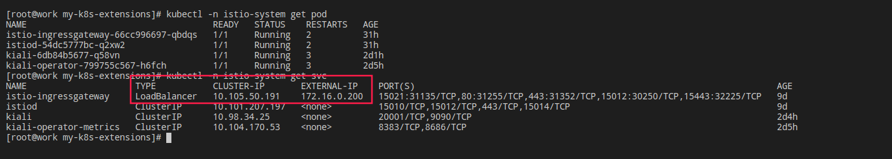

istio
======

> [istio](https://istio.io/latest/zh/docs/)可以轻松的创建一个服务网格，对业务代码基本上是０侵入性．istio是通过准入控制的方式，在pod中加入sidecar代理拦截所有容器的网络通信，然后通过控制平面来配置和管理istio. 

- [流量管理](https://www.taozhang.net.cn/#/mesh/istio?id=%e6%b5%81%e9%87%8f%e7%ae%a1%e7%90%86)
- 可观测性

## 安装

```bash
curl -L https://istio.io/downloadIstio | sh -
cd istio-1.8.2
istioctl install
```
结合[前面的metallb工具](https://www.taozhang.net.cn/#/k8s/net_01?id=%e5%a4%96%e9%83%a8%e6%b5%81%e9%87%8f%e5%af%bc%e5%85%a5%e9%9b%86%e7%be%a4)，将外部loadbalancer将流量导入到集群内部．　



## 流量管理