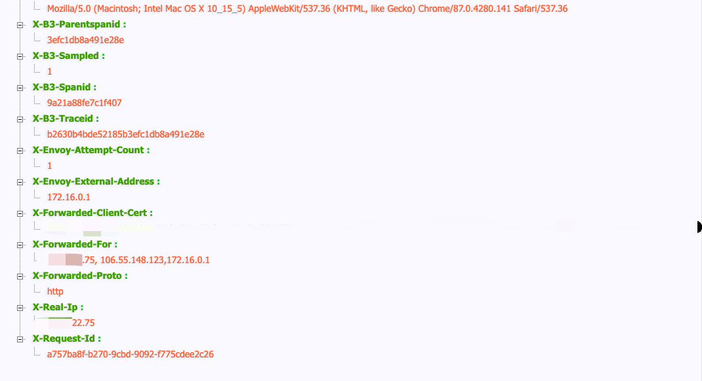
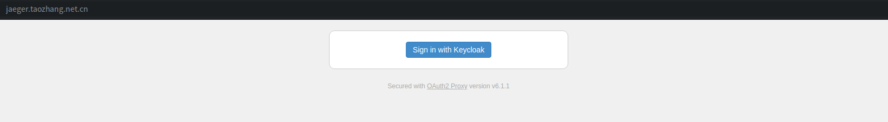
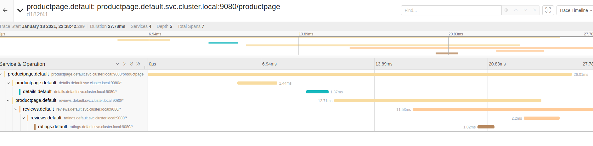

jaeger
=============
  
> jaeger遵循OpenTracing规范（OpenTracing制定了一套平台无关、厂商无关的Trace协议，使得开发人员能够方便的添加或更换分布式追踪系统的实现，早在近十年前就已经制定；与它相关的还有谷歌的OpenCensus，  还有两者合并后的OpenTelemetry）．
  
## 安装

k8s安装，也可以见[官方配置](https://www.jaegertracing.io/docs/1.21/operator/)，安装很简单．

```yaml
# Role&clusterRole  
kubectl -n kube-monitor apply -f https://www.taozhang.net.cn/mesh/files/jaeger/rbac.yaml
# operator  
kubectl -n kube-monitor apply -f https://www.taozhang.net.cn/mesh/files/jaeger/operator.yaml
# crd资源  
kubectl create -f https://www.taozhang.net.cn/mesh/files/jaeger/crd.yaml
```

## 分布式追踪原理

[分布式追踪论文dapper](https://research.google/pubs/pub36356/), ([中文译文](http://alphawang.com/blog/google-dapper-translation/))，jaeger就是基于dapper实现的．

在istio中，envoy集成了分布式追踪的功能，业务代码中也需要透传以下header头（业务代码请求第三方的时候，需要透传header信息）．

| 请求项 | 说明 |
| --- | --- |
| x-request-id | 为整个请求提供一致性追踪|
| x-b3-traceid| 追踪的总体ID, 每个span都会有这个ID |
| x-b3-spanid | 表示当前追踪树的位置|
| x-b3-parentid | 追踪树中，父节点的位置|
| x-b3-smapled | 当采样标志为1时，这个索引将被报告给跟踪系统。一旦采样设置为0或1，相同的值应始终向下游发送。|



## 配置SSO
jaeger是不带认证的，所以需要通过oauth2 proxy来进行认证．　

```bash
# 配置oauth2
kubectl -n kube-monitor apply -f https://www.taozhang.net.cn/mesh/files/jaeger/oauth2.yaml
```



## 与istio结合

jaeger作为istio的addon组件，需要通过指定相应配置，将jaeger集成到istio中．　
```bash
istioctl install --set profile=default -y \
--set meshConfig.defaultConfig.tracing.zipkin.address=jaeger-collector.kube-monitor:9411 \
--set values.pilot.traceSampling=100
```

