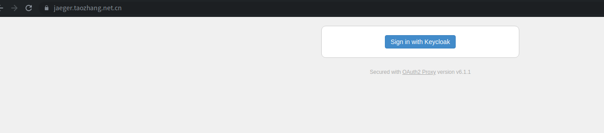

jaeger
=============
  
> jaeger遵循OpenTracing规范（OpenTracing制定了一套平台无关、厂商无关的Trace协议，使得开发人员能够方便的添加或更换分布式追踪系统的实现，早在近十年前就已经制定；与它相关的还有谷歌的OpenCensus，  还有两者合并后的OpenTelemetry）．
  
## 安装

k8s安装，也可以见[官方配置](https://www.jaegertracing.io/docs/1.21/operator/)，安装很简单．

- Role&clusterRole  
  ```yaml
  kind: ClusterRoleBinding
  apiVersion: rbac.authorization.k8s.io/v1
  metadata:
    name: jaeger-operator
  subjects:
    - kind: ServiceAccount
      name: jaeger-operator
      namespace: "kube-monitor" # change to point to the namespace you installed your operator
  roleRef:
    kind: ClusterRole
    name: jaeger-operator
    apiGroup: rbac.authorization.k8s.io
  ---
  ## When using the operator in cluster-wide mode, this ClusterRole has to be created and bound to the jaeger-operator service account,
  ## so that the operator can watch and create resources in every namespace in the cluster.
  ## An alternative to this cluster role is to create one role binding for each namespace that the operator should watch
  ## in that case, don't forget to add a comma-separated list of namespaces as WATCH_NAMESPACE in the operator's deployment.
  ## Further down in this file there's another set of rules, with extra optional permissions
  apiVersion: rbac.authorization.k8s.io/v1
  kind: ClusterRole
  metadata:
    name: jaeger-operator
  rules:
  
    ## our own custom resources
    - apiGroups:
        - jaegertracing.io
      resources:
        - '*'
      verbs:
        - create
        - delete
        - get
        - list
        - patch
        - update
        - watch
  
    ## for the operator's own deployment
    - apiGroups:
        - apps
      resourceNames:
        - jaeger-operator
      resources:
        - deployments/finalizers
      verbs:
        - update
  
    ## regular things the operator manages for an instance, as the result of processing CRs
    - apiGroups:
        - ""
      resources:
        - configmaps
        - persistentvolumeclaims
        - pods
        - secrets
        - serviceaccounts
        - services
        - services/finalizers
      verbs:
        - create
        - delete
        - get
        - list
        - patch
        - update
        - watch
    - apiGroups:
        - apps
      resources:
        - deployments
        - daemonsets
        - replicasets
        - statefulsets
      verbs:
        - create
        - delete
        - get
        - list
        - patch
        - update
        - watch
    - apiGroups:
        - extensions
      resources:
        - ingresses
      verbs:
        - create
        - delete
        - get
        - list
        - patch
        - update
        - watch
    # Ingress for kubernetes 1.14 or higher
    - apiGroups:
        - networking.k8s.io
      resources:
        - ingresses
      verbs:
        - create
        - delete
        - get
        - list
        - patch
        - update
        - watch
    - apiGroups:
        - batch
      resources:
        - jobs
        - cronjobs
      verbs:
        - create
        - delete
        - get
        - list
        - patch
        - update
        - watch
    - apiGroups:
        - route.openshift.io
      resources:
        - routes
      verbs:
        - create
        - delete
        - get
        - list
        - patch
        - update
        - watch
    - apiGroups:
        - console.openshift.io
      resources:
        - consolelinks
      verbs:
        - create
        - delete
        - get
        - list
        - patch
        - update
        - watch
    - apiGroups:
        - autoscaling
      resources:
        - horizontalpodautoscalers
      verbs:
        - create
        - delete
        - get
        - list
        - patch
        - update
        - watch
  
    ## needed if you want the operator to create service monitors for the Jaeger instances
    - apiGroups:
        - monitoring.coreos.com
      resources:
        - servicemonitors
      verbs:
        - create
        - delete
        - get
        - list
        - patch
        - update
        - watch
  
    ## for the Elasticsearch auto-provisioning
    - apiGroups:
        - logging.openshift.io
      resources:
        - elasticsearches
      verbs:
        - create
        - delete
        - get
        - list
        - patch
        - update
        - watch
  
    ## for the Kafka auto-provisioning
    - apiGroups:
        - kafka.strimzi.io
      resources:
        - kafkas
        - kafkausers
      verbs:
        - create
        - delete
        - get
        - list
        - patch
        - update
        - watch
  
    ## Extra permissions
    ## This is an extra set of permissions that the Jaeger Operator might make use of if granted
  
    ## needed if support for injecting sidecars based on namespace annotation is required
    - apiGroups:
        - ""
      resources:
        - namespaces
      verbs:
        - 'get'
        - 'list'
        - 'watch'
  
    ## needed if support for injecting sidecars based on deployment annotation is required, across all namespaces
    - apiGroups:
        - apps
      resources:
        - deployments
      verbs:
        - get
        - list
        - patch
        - update
        - watch
  
    ## needed only when .Spec.Ingress.Openshift.DelegateUrls is used
    - apiGroups:
        - rbac.authorization.k8s.io
      resources:
        - clusterrolebindings
      verbs:
        - create
        - delete
        - get
        - list
        - patch
        - update
        - watch
  ---
  kind: RoleBinding
  apiVersion: rbac.authorization.k8s.io/v1
  metadata:
    name: jaeger-operator
  subjects:
    - kind: ServiceAccount
      name: jaeger-operator
  roleRef:
    kind: Role
    name: jaeger-operator
    apiGroup: rbac.authorization.k8s.io
  ---
  kind: ClusterRoleBinding
  apiVersion: rbac.authorization.k8s.io/v1
  metadata:
    name: jaeger-operator
  subjects:
    - kind: ServiceAccount
      name: jaeger-operator
      namespace: "kube-monitor" # change to point to the namespace you installed your operator
  roleRef:
    kind: ClusterRole
    name: jaeger-operator
    apiGroup: rbac.authorization.k8s.io
  ---
  kind: RoleBinding
  apiVersion: rbac.authorization.k8s.io/v1
  metadata:
    name: jaeger-operator
  subjects:
    - kind: ServiceAccount
      name: jaeger-operator
  roleRef:
    kind: Role
    name: jaeger-operator
    apiGroup: rbac.authorization.k8s.io
  ---
  ## this is a set of basic permissions the Jaeger Operator needs when restricted to work in specific namespaces
  apiVersion: rbac.authorization.k8s.io/v1
  kind: Role
  metadata:
    name: jaeger-operator
  rules:
  
    ## our own custom resources
    - apiGroups:
        - jaegertracing.io
      resources:
        - '*'
      verbs:
        - create
        - delete
        - get
        - list
        - patch
        - update
        - watch
  
    ## for the operator's own deployment
    - apiGroups:
        - apps
      resourceNames:
        - jaeger-operator
      resources:
        - deployments/finalizers
      verbs:
        - update
  
    ## regular things the operator manages for an instance, as the result of processing CRs
    - apiGroups:
        - ""
      resources:
        - configmaps
        - persistentvolumeclaims
        - pods
        - secrets
        - serviceaccounts
        - services
        - services/finalizers
      verbs:
        - create
        - delete
        - get
        - list
        - patch
        - update
        - watch
    - apiGroups:
        - apps
      resources:
        - deployments
        - daemonsets
        - replicasets
        - statefulsets
      verbs:
        - create
        - delete
        - get
        - list
        - patch
        - update
        - watch
    - apiGroups:
        - extensions
      resources:
        - ingresses
      verbs:
        - create
        - delete
        - get
        - list
        - patch
        - update
        - watch
    # Ingress for kubernetes 1.14 or higher
    - apiGroups:
        - networking.k8s.io
      resources:
        - ingresses
      verbs:
        - create
        - delete
        - get
        - list
        - patch
        - update
        - watch
    - apiGroups:
        - batch
      resources:
        - jobs
        - cronjobs
      verbs:
        - create
        - delete
        - get
        - list
        - patch
        - update
        - watch
    - apiGroups:
        - route.openshift.io
      resources:
        - routes
      verbs:
        - create
        - delete
        - get
        - list
        - patch
        - update
        - watch
    - apiGroups:
        - image.openshift.io
      resources:
        - imagestreams
      verbs:
        - create
        - delete
        - get
        - list
        - patch
        - update
        - watch
    - apiGroups:
        - autoscaling
      resources:
        - horizontalpodautoscalers
      verbs:
        - create
        - delete
        - get
        - list
        - patch
        - update
        - watch
  
    ## needed if you want the operator to create service monitors for the Jaeger instances
    - apiGroups:
        - monitoring.coreos.com
      resources:
        - servicemonitors
      verbs:
        - create
        - delete
        - get
        - list
        - patch
        - update
        - watch
  
    ## for the Elasticsearch auto-provisioning
    - apiGroups:
        - logging.openshift.io
      resources:
        - elasticsearches
      verbs:
        - create
        - delete
        - get
        - list
        - patch
        - update
        - watch
  
    ## for the Kafka auto-provisioning
    - apiGroups:
        - kafka.strimzi.io
      resources:
        - kafkas
        - kafkausers
      verbs:
        - create
        - delete
        - get
        - list
        - patch
        - update
        - watch
  ---
  apiVersion: v1
  kind: ServiceAccount
  metadata:
    name: jaeger-operator
  ```
- operator  
  ```yaml
  apiVersion: apps/v1
  kind: Deployment
  metadata:
    name: jaeger-operator
  spec:
    replicas: 1
    selector:
      matchLabels:
        name: jaeger-operator
    template:
      metadata:
        labels:
          name: jaeger-operator
      spec:
        serviceAccountName: jaeger-operator
        containers:
          - name: jaeger-operator
            image: jaegertracing/jaeger-operator:1.21.2
            ports:
              - containerPort: 8383
                name: http-metrics
              - containerPort: 8686
                name: cr-metrics
            args: ["start"]
            imagePullPolicy: Always
            env:
              - name: WATCH_NAMESPACE
                value:
              - name: POD_NAME
                valueFrom:
                  fieldRef:
                    fieldPath: metadata.name
              - name: POD_NAMESPACE
                valueFrom:
                  fieldRef:
                    fieldPath: metadata.namespace
              - name: OPERATOR_NAME
                value: "jaeger-operator"
  ```
- crd资源  
  ```bash
  kubectl create -f https://raw.githubusercontent.com/jaegertracing/jaeger-operator/master/deploy/crds/jaegertracing.io_jaegers_crd.yaml
  ```
## 配置SSO
jaeger是不带认证的，所以需要通过oauth2 proxy来进行认证．　


```yaml
apiVersion: v1
kind: ConfigMap
metadata:
  labels:
    k8s-app: jaeger-oauth
    version: v1
  name: jaeger-oauth
  namespace: kube-monitor
data:
  oauth-proxy.cfg: |
    ## OAuth2 Proxy Config File
    ## https://github.com/oauth2-proxy/oauth2-proxy
    http_address = ":8080"
    reverse_proxy = true
    ## provider
    provider = "keycloak"
    client_id = "jaeger"
    client_secret = "{秘钥}"
    login_url = "https://keycloak.taozhang.net.cn/auth/realms/k8s-openid/protocol/openid-connect/auth"
    redeem_url = "https://keycloak.taozhang.net.cn/auth/realms/k8s-openid/protocol/openid-connect/token"
    validate_url = "https://keycloak.taozhang.net.cn/auth/realms/k8s-openid/protocol/openid-connect/userinfo"
    redirect_url = "https://jaeger.taozhang.net.cn/oauth2/callback"
    insecure_oidc_allow_unverified_email=true
    keycloak_group = "/managers"
    scope = "openid email profile offline_access"
    upstreams = [
         "http://jaeger-query:16686"
    ]
    cookie_secret = "{秘钥}"
    cookie_domains = [
      ".taozhang.net.cn"
    ]
    ## 可信email， 会与scope中的email对比。
    email_domains = [
      "*"
    ]
    pass_user_headers = true
    pass_access_token = true
    pass_authorization_header = true
---
apiVersion: apps/v1
kind: Deployment
metadata:
  name: jaeger-oauth
  namespace: kube-monitor
  labels:
    k8s-app: jaeger-oauth
    version: v1
spec:
  replicas: 1
  selector:
    matchLabels:
      k8s-app: jaeger-oauth
      version: v1
  template:
    metadata:
      labels:
        k8s-app: jaeger-oauth
        version: v1
    spec:
      containers:
        - name: jaeger-oauth
          image: quay.io/oauth2-proxy/oauth2-proxy:v6.1.1
          command: ["/bin/oauth2-proxy"]
          args:
          - --config=/etc/oauth-proxy.cfg
          volumeMounts:
            - mountPath: /etc/oauth-proxy.cfg
              name: conf
              subPath: oauth-proxy.cfg  
          ports:
            - containerPort: 8080
              protocol: TCP
          resources:
            limits:
              cpu: 300m
              memory: 256Mi
            requests:
              cpu: 100m
              memory: 64Mi
          livenessProbe:
            httpGet:
              path: /ping
              port: 8080
          readinessProbe:
            httpGet:
              path: /ping
              port: 8080
      volumes:
        - name: conf
          configMap:
            name: jaeger-oauth
            items:
            - key: oauth-proxy.cfg
              path: oauth-proxy.cfg
---
apiVersion: v1
kind: Service
metadata:
  name: jaeger-oauth-query
  namespace: kube-monitor
spec:
  type: ClusterIP
  ports:
    - name: http
      port: 80
      targetPort: 8080
  selector:
    k8s-app: jaeger-oauth
    version: v1
```