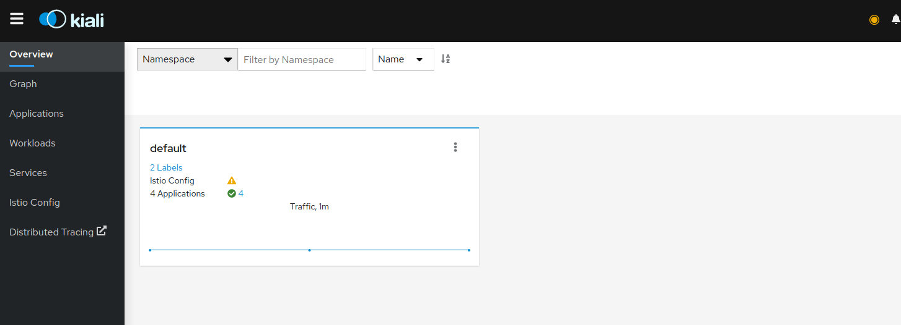

kiali可观测平台
====

> kiali为istio提供了查看相关服务与配置提供了统一化的可视化界面，并且能在其中展示他们的关联；同时还提供了界面, 可以很方便的验证 istio 配置与错误提示. 

## 安装

```bash
helm install \
--set cr.create=true \
--set cr.namespace=istio-system \
--namespace istio-system \
--repo https://kiali.org/helm-charts \
kiali-operator \
kiali-operator

# 配置OIDC配置
kubectl create secret generic kiali --from-literal="oidc-secret=${CLIENT_SECRET}" -n istio-system
```

下面是个人的配置，　可以根据[官方的配置](https://github.com/kiali/kiali-operator/blob/master/deploy/kiali/kiali_cr.yaml)文件去自定义．
```yaml
apiVersion: kiali.io/v1alpha1
kind: Kiali
metadata:
  name: kiali
  annotations:
    ansible.operator-sdk/verbosity: "1"
spec:
  auth:
    strategy: openid
    openid:
      client_id: "kiali"
      issuer_uri: "https://keycloak.taozhang.net.cn/auth/realms/k8s-openid"
      authentication_timeout: 300
      insecure_skip_verify_tls: true
      scopes: ["openid", "profile", "email"]
      disable_rbac: true
  external_services:
    custom_dashboards:
      enabled: true
    tracing:
      enabled: true
      url: https://jaeger.taozhang.net.cn
      in_cluster_url: http://jaeger-query.kube-monitor:16686
    prometheus:
      url: http://thanos-querier.kube-monitor:9090
  server:
    web_schema: https
    web_port: 443
  api:
    namespaces: 
      exclude:
      - "kube-system"
      - "rook-ceph"
      - "metallb-system"
      - "local-path-storage"
      - "istio-system"
```

