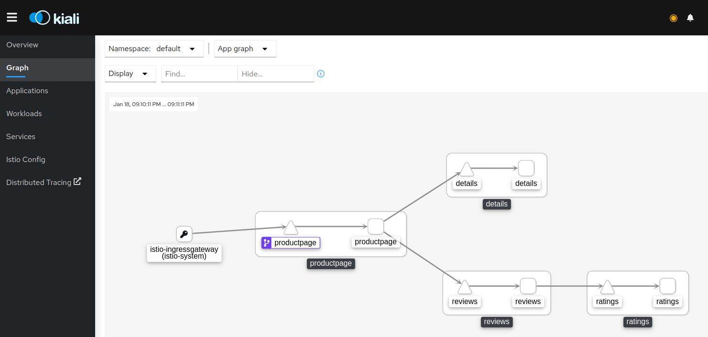
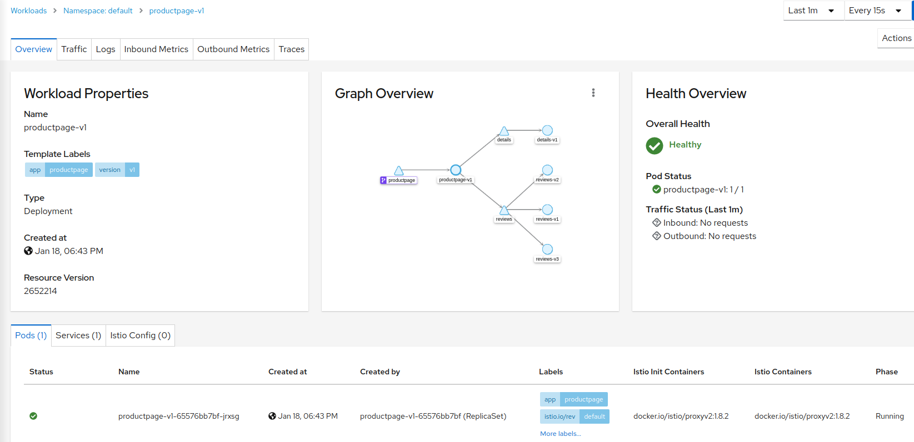
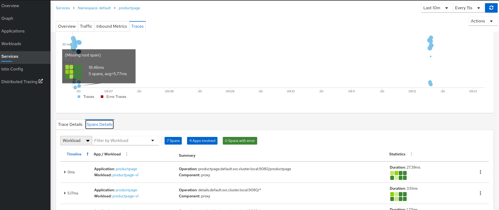

综合应用
=================

> 结合官方的[bookinfo例子](https://github.com/istio/istio/tree/master/samples/bookinfos)进行综合应用．　

## 部署bookinfo

- [bookinfo官方例子](https://github.com/istio/istio/tree/master/samples/bookinfos)  
  ```bash
  # 通过准入控制器，default namespace 中的pod会自动注入envoy sidecar
  kubectl label namespace default istio-injection=enabled
  # 部署bookinfo
  kubectl apply -f samples/bookinfo/platform/kube/bookinfo.yaml
  ```

- gateway配置（稍作调整）    
  ```bash
  kubectl apply -f https://www.taozhang.net.cn/mesh/files/mesh/gateway.yaml
  ```
- [访问Demo](https://demo.taozhang.net.cn)  
  

## kiali可观测

- 服务可视化  
  
  


- 链路可视化(kiali对接了jaeger)    
  


