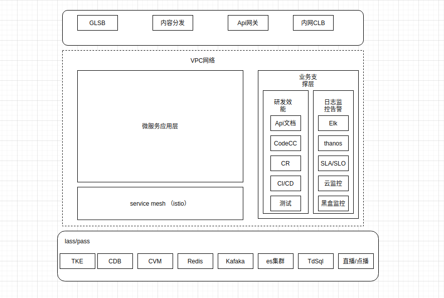

环境准备
=========

> 在公有云（腾讯云为例子）上搭建微服务分布式系统，还是很方便的，公有云提供了底层的lass/pass服务，网络层提供了vpc/Nat网关/ACL权限控制，在高可用上也可以通过两地(同城不同可用区)三中心(跨地域)的方式搭建. 只需要根据业务需求，去组装云服务即可．

## 私有k8s集群

私有k8s集群，为了方便，很多服务就直接部署在k8s集群内部．

- 母机防火墙配置
- 虚拟机镜像构建
- k8s集群搭建
- elk/efk部署
- prometheus等监控告警系统
- istio部署，集成jaeger/kiali组件
- 微服务框架