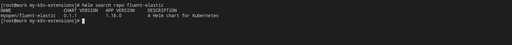
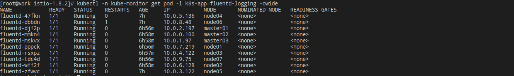
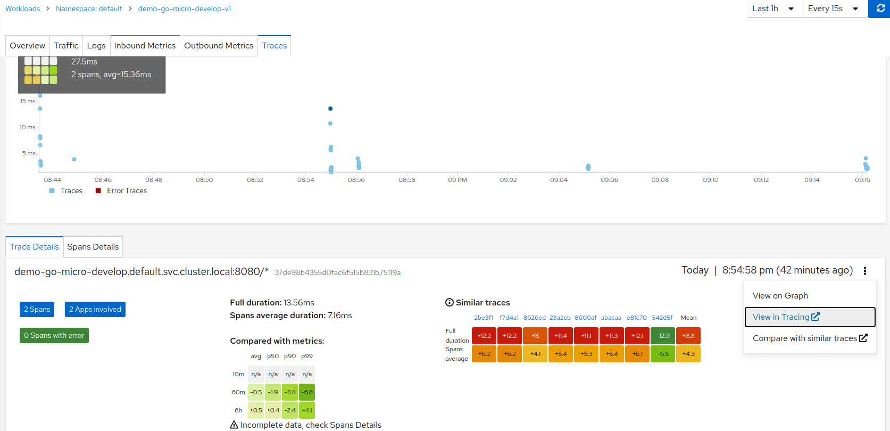
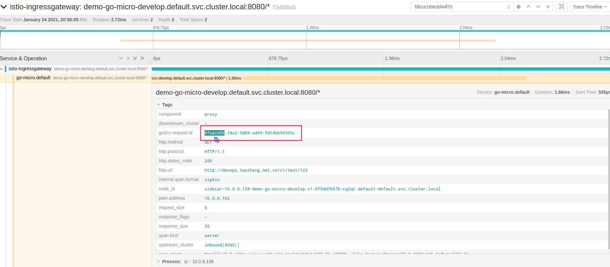
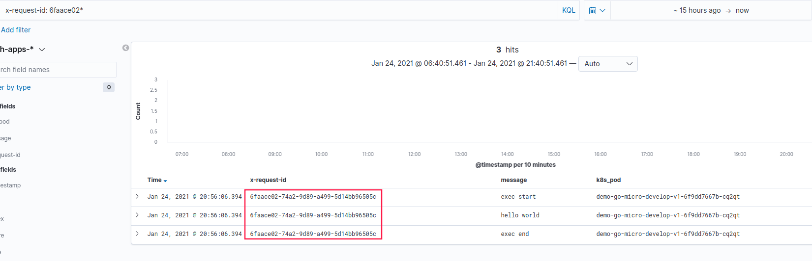

fluentd
=============

> [fluentd](https://docs.fluentd.org/)是一个免费开源的日志收集器，使用json统一日志结构，具有[很多插件](https://www.fluentd.org/plugins/all)，性能也不错．是从CNCF的项目之一．

## 安装  

以DaemonSet方式，将Fluentd安装到每个Node节点．集群中master的三个节点和安装了ceph-rook的三个节点都打了污点，所以在安装fluent的时候需要[容忍申明](https://www.taozhang.net.cn/#/k8s/scheduler_01?id=%e6%b1%a1%e7%82%b9%e5%92%8c%e5%ae%b9%e5%bf%8d). 

```bash
# 容忍申明
tolerations:
- key: node-role.kubernetes.io/master
  effect: NoSchedule
- key: node-role.kubernetes.io/rook-ceph
  effect: NoSchedule
```
我把fluentd制作了[chart包](https://www.taozhang.net.cn/monitor/files/fluentd/fluent-elastic-0.1.1.tgz):


```bash
helm repo add myopen https://harbor.taozhang.net.cn/chartrepo/open
helm repo update
helm repo search repo fluent-elastic
helm upgrade --install -n kube-monitor --version 0.1.1 fluent-elastic -f fluent-values.yaml myopen/fluent-elastic
``` 


## 配置参考

镜像是基于[fluent/fluentd-kubernetes-daemonset](https://hub.docker.com/r/fluent/fluentd-kubernetes-daemonset)实现的，Dockerfile在[我的git](https://git.taozhang.net.cn/open/dockerfiles/src/branch/master/fluent/elastic/Dockerfile)上. 在官方镜像上的基础上，增加了fluent-plugin-kubernetes_metadata_filter，fluent-plugin-record-modifier两个插件．fluentd-kubernetes-daemonset启动的时候，是从/fluentd/etc目录中读取配置文件. 

- [fluent-plugin-kubernetes_metadata_filter](https://github.com/fabric8io/fluent-plugin-kubernetes_metadata_filter)  
  通过API Server获取POD的metadata信息，在部署pod的时候可以在meatada中加入enableFluentd: true，表示当前pod的日志接入到后端日志存储系统．
- [fluent-plugin-record-modifier](https://github.com/repeatedly/fluent-plugin-record-modifier)  
  这个插件可以在原有的信息上修改和增加信息．　
  

这里是我的主要配置文件[kubernetes.conf](https://www.taozhang.net.cn/monitor/files/fluentd/kubernetes.conf)，也可以下载[我的chart包](https://www.taozhang.net.cn/monitor/files/fluentd/fluent-elastic-0.1.1.tgz)查看具体的配置．


## 应用程序接入日志

- 应用程序中pod的metadata下的annotations中注入
  ```yaml
  annotations:
    enableFluentd: true
  ```
　fluentd在收集日志的时候，会通过API Server拿到Pod的metadata信息，在fluentd配置中通过grep filter把没有注入annotations的pod丢弃，只保留enableFluentd为true的pod日志．

- 结合[分布式追踪](https://www.taozhang.net.cn/#/mesh/jaeger?id=%e5%88%86%e5%b8%83%e5%bc%8f%e8%bf%bd%e8%b8%aa%e5%8e%9f%e7%90%86)  
  istio整合了分布式追踪组件，在分布式追踪中，x-request-id伴随着整个链路请求，应用程序在打日志的时候，可以从header头中拿到x-request-id，注入到日志中，这样在解决定位线上问题的时候具有很大的帮助．

  **在kiali平台找对应的trace信息**
  

  **点击view in Tracing > 跳转到 jaeger平台**

  

  **根据x-request-id在kibana找到链路日志**

  


