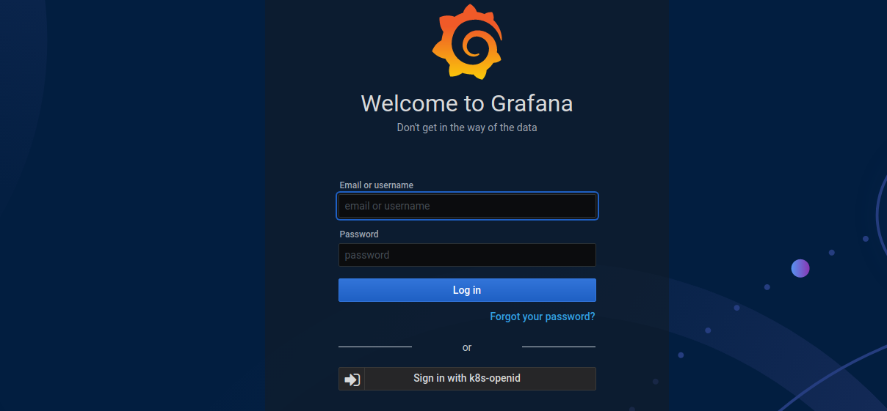

grafana
========
> grafana是一个前端展示工具，可以对接很多数据平台（prometheus），把数据以图形的方式展示出来．

## 安装

直接通过[istio安装grafana](https://github.com/istio/istio/blob/master/samples/addons/grafana.yaml).

```bash
kubectl -n kube-monitor apply -f https://github.com/istio/istio/blob/master/samples/addons/grafana.yaml
```

## 配置OSS认证



```yaml
apiVersion: v1
kind: ConfigMap
metadata:
  name: grafana-env
  namespace: kube-monitor
  labels:
    app: grafana
    version: v1
data:
  GF_SERVER_ROOT_URL: "https://grafana.taozhang.net.cn"
  GF_AUTH_BASIC_ENABLED: "true"
  GF_AUTH_ANONYMOUS_ENABLED: "false"
  GF_SECURITY_ADMIN_PASSWORD: "{管理员密码}"
  GF_AUTH_GENERIC_OAUTH_ENABLED: "true"
  GF_AUTH_GENERIC_OAUTH_NAME: "k8s-openid"
  GF_AUTH_GENERIC_OAUTH_ALLOW_SIGN_UP: "true"
  GF_AUTH_GENERIC_OAUTH_CLIENT_ID: "grafana"
  GF_AUTH_GENERIC_OAUTH_CLIENT_SECRET: "{秘钥}"
  GF_AUTH_GENERIC_OAUTH_SCOPES: "openid profile email"
  GF_AUTH_GENERIC_OAUTH_AUTH_URL: "https://keycloak.taozhang.net.cn/auth/realms/k8s-openid/protocol/openid-connect/auth"
  GF_AUTH_GENERIC_OAUTH_TOKEN_URL: "https://keycloak.taozhang.net.cn/auth/realms/k8s-openid/protocol/openid-connect/token"
---
# 对istio的grafana做一点小修改，支持sso
envFrom:
- configMapRef:
    name: grafana-env
```
