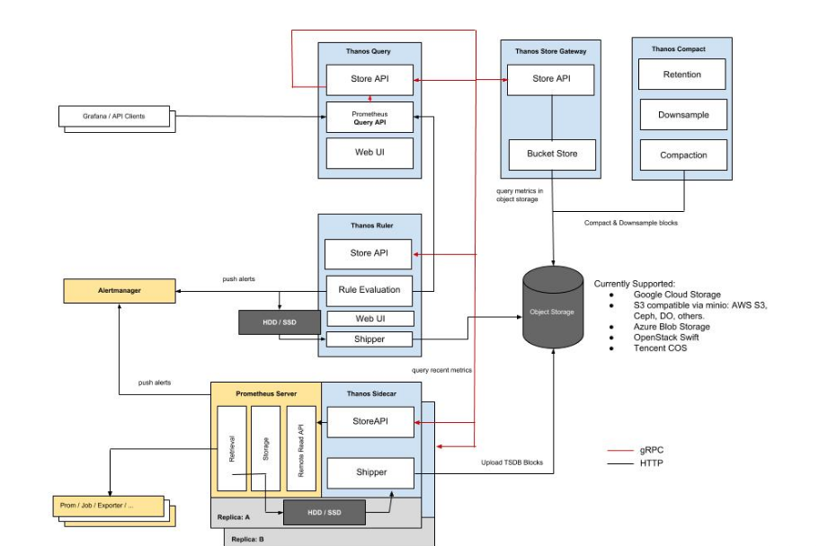

thanos架构
===========

> [thanos](https://thanos.io/)是基于prometheus的一套监控方案，具有高可用，动态扩展，长期存储的优点. thanos以thanos query为统一查询入口，屏蔽了上游的prometheus集群，并且对上游数据进行去重．非常方便水平扩展．



## 组件

| 组件名 | 作用 |
| --- | --- |
| thanos query | 查询网关，实现prometheus的API接口，可以汇集sidecar/store gateway(对象存储)数据 |
| Sidecar | prometheus的sidecar组件，将prometheus暴露给thanos query, 提供实时查询，并定时将数据上传到对象存储 |
| Store Gateway | 将对象存储的数据暴露出来 |
| thaos compactor | 对云存储数据进行压缩采样|
| 对象存储 | 提供永久存储 |
| Ruler | 告警规则 |
| alertmanager| 告警组件，可对接第三方通信平台(微信，钉钉)等|

## 部署

- 新增ceph object storage 
```yaml
apiVersion: objectbucket.io/v1alpha1
kind: ObjectBucketClaim
metadata:
  name: thanos-bucket
  namespace: rook-ceph
spec:
  generateBucketName: thanos-bucket
  storageClassName: rook-ceph-bucket
```
- 获取对象存储秘钥
```bash
ENDPOINT=rook-ceph-rgw-my-store.rook-ceph:80
ACCESS_KEY=$(kubectl -n rook-ceph  get secret rook-ceph-object-user-my-store-thaos-oss-user -o jsonpath='{.data.AccessKey}' | base64 --decode)
SECRET_KEY=$(kubectl -n rook-ceph  get secret rook-ceph-object-user-my-store-thaos-oss-user -o jsonpath='{.data.SecretKey}' | base64 --decode)
BUCKET_NAME=thanos-bucket
INSECURE=true
cat > ./thanos-oss.yaml <<EOF
type: s3
config:
  bucket: ${ENDPOINT}
  endpoint: ${ENDPOINT}
  access_key: ${ACCESS_KEY}
  secret_key: ${SECRET_KEY}
  insecure: ${INSECURE}
  signature_version2: false
EOF
kubectl create secret generic thanos-oss --from-file=thanos-oss.yaml=thanos-oss.yaml -n kube-monitor
```
- 配置rbac  
    ```yaml
    apiVersion: v1
    kind: ServiceAccount
    metadata:
      name: prometheus
    namespace: kube-monitor
    ---
    apiVersion: rbac.authorization.k8s.io/v1
    kind: ClusterRole
    metadata:
      name: prometheus
    rules:
    - apiGroups:
        - ""
        resources:
        - nodes
        - services
        - endpoints
        - pods
        - nodes/proxy
        verbs:
        - get
        - list
        - watch
    - apiGroups:
        - "extensions"
        resources:
        - ingresses
        verbs:
        - get
        - list
        - watch
    - apiGroups:
        - ""
        resources:
        - configmaps
        - nodes/metrics
        verbs:
        - get
    - nonResourceURLs:
        - /metrics
        verbs:
        - get
    ---
    apiVersion: rbac.authorization.k8s.io/v1
    kind: ClusterRoleBinding
    metadata:
    name: prometheus
    roleRef:
    apiGroup: rbac.authorization.k8s.io
    kind: ClusterRole
    name: prometheus
    subjects:
    - kind: ServiceAccount
        name: prometheus
        namespace: kube-monitor
    ```
- 部署compactor组件  
  ```yaml
  apiVersion: apps/v1
  kind: StatefulSet
  metadata:
    name: compactor
    namespace: kube-monitor
    labels:
      app: compactor
  spec:
    replicas: 1
    selector:
      matchLabels:
        app: compactor
    serviceName: compactor
    template:
      metadata:
        labels:
          app: compactor
      spec:
        containers:
          - name: thanos
            image: thanosio/thanos:v0.11.0
            args:
              - "compact"
              - "--log.level=debug"
              - "--data-dir=/data"
              - "--objstore.config-file=/etc/secret/thanos-oss.yaml"
              - "--wait"
            ports:
              - name: http
                containerPort: 10902
            livenessProbe:
              httpGet:
                port: 10902
                path: /-/healthy
              initialDelaySeconds: 10
            readinessProbe:
              httpGet:
                port: 10902
                path: /-/ready
              initialDelaySeconds: 15
            volumeMounts:
              - name: oss
                mountPath: /etc/secret
                readOnly: false
        volumes:
          - name: oss
            secret:
              secretName: thanos-oss
  ---
  apiVersion: v1
  kind: Service
  metadata:
    name: compactor
    namespace: kube-monitor
    labels:
      app: compactor
  spec:
    ports:
      - port: 10902
        targetPort: http
        name: http
      selector:
        app: compactor
    ```
- 部署store gateway组件  
  ```yaml
  apiVersion: apps/v1
  kind: StatefulSet
  metadata:
    name: store-gateway
    namespace: kube-monitor
    labels:
      app: store-gateway
      thanos-store: "true"
  spec:
    replicas: 1
    selector:
      matchLabels:
        app: store-gateway
        thanos-store: "true"
    serviceName: store-gateway
    template:
      metadata:
        labels:
          app: store-gateway
          thanos-store: "true"
      spec:
        containers:
          - name: thanos
            image: thanosio/thanos:v0.11.0
            args:
              - "store"
              - "--log.level=error"
              - "--data-dir=/data"
              - "--objstore.config-file=/etc/secret/thanos-oss.yaml"
              - "--index-cache-size=500MB"
              - "--chunk-pool-size=500MB"
            ports:
              - name: http
                containerPort: 10902
              - name: grpc
                containerPort: 10901
            livenessProbe:
              httpGet:
                port: 10902
                path: /-/healthy
            readinessProbe:
              httpGet:
                port: 10902
                path: /-/ready
            volumeMounts:
              - name: oss
                mountPath: /etc/secret
                readOnly: false
        volumes:
          - name: oss
            secret:
              secretName: thanos-oss
  ---
  apiVersion: v1
  kind: Service
  metadata:
    name: store-gateway
    namespace: kube-monitor
    labels:
      app: store-gateway
      thanos-store: "true"
  spec:
    type: ClusterIP
    clusterIP: None
    ports:
      - port: 10901
        targetPort: grpc
        name: grpc
    selector:
      app: store-gateway
      thanos-store: "true"
  
  ```
- 部署sidecar组件  
  ```yaml
  apiVersion: apps/v1
  kind: StatefulSet
  metadata:
    name: thanos-sidecar
    namespace: kube-monitor
    labels:
      app: thanos-sidecar
      thanos-store: "true"
  spec:
    serviceName: "thanos-sidecar"
    replicas: 2
    selector:
      matchLabels:
        app: thanos-sidecar
        thanos-store: "true"
    template:
      metadata:
        labels:
          app: thanos-sidecar
          thanos-store: "true"
      spec:
        serviceAccountName: prometheus
        initContainers:
          - name: fix-permissions
            image: busybox
            command: ["sh", "-c", "chmod -R 777 /prometheus"]
            volumeMounts:
              - name: data
                mountPath: "/prometheus"
        volumes:
          - name: prometheus-config
            configMap:
              name: prometheus-config
          - name: prometheus-rules
            configMap:
              name: prometheus-rules
          - name: prometheus-config-shared
            emptyDir: {}
          - name: oss
            secret:
              secretName: thanos-oss
        containers:
          - name: prometheus
            image: prom/prometheus:v2.22.2
            imagePullPolicy: IfNotPresent
            args:
              - "--config.file=/etc/prometheus-shared/prometheus.yaml"
              - "--storage.tsdb.path=/prometheus"
              - "--storage.tsdb.retention.time=6h"
              - "--storage.tsdb.no-lockfile"
              - "--storage.tsdb.min-block-duration=2h"
              - "--storage.tsdb.max-block-duration=2h"
              - "--web.enable-admin-api"
              - "--web.enable-lifecycle"  # 支持热更新  localhost:9090/-/reload 加载
            ports:
              - name: http
                containerPort: 9090
            resources:
              requests:
                memory: "512Mi"
                cpu: "0.5"
            volumeMounts:
              - name: prometheus-config-shared
                mountPath: /etc/prometheus-shared/
              - name: prometheus-rules
                mountPath: /etc/prometheus/rules
              - name: data
                mountPath: "/prometheus"
          - name: thanos
            image: thanosio/thanos:v0.11.0
            imagePullPolicy: IfNotPresent
            args:
              - sidecar
              - --log.level=info
              - --tsdb.path=/prometheus
              - --prometheus.url=http://localhost:9090
              - --reloader.config-file=/etc/prometheus/prometheus.yaml.tmpl
              - --reloader.config-envsubst-file=/etc/prometheus-shared/prometheus.yaml
              - --reloader.rule-dir=/etc/prometheus/rules/
              - --objstore.config-file=/etc/secret/thanos-oss.yaml
            ports:
              - name: http-sidecar
                containerPort: 10902
              - name: grpc
                containerPort: 10901
            env:
              - name: POD_NAME
                valueFrom:
                  fieldRef:
                    fieldPath: metadata.name
            resources:
              requests:
                memory: "512Mi"
                cpu: "0.5"
            volumeMounts:
              - name: prometheus-config-shared
                mountPath: /etc/prometheus-shared/
              - name: prometheus-config
                mountPath: /etc/prometheus
              - name: prometheus-rules
                mountPath: /etc/prometheus/rules
              - name: data
                mountPath: "/prometheus"
              - name: oss
                mountPath: /etc/secret
                readOnly: false
    volumeClaimTemplates:  # 由于prometheus每2h生成一个TSDB数据块，所以还是需要保存本地的数据
      - metadata:
          name: data
          labels:
            app: prometheus
        spec:
          storageClassName: rook-ceph-block
          accessModes:
            - ReadWriteOnce
          resources:
            requests:
              storage: 10Gi
  ---
  apiVersion: v1
  kind: Service
  metadata:
    name: thanos-sidecar
    namespace: kube-monitor
    labels:
      app: thanos-sidecar
      thanos-store: "true"
  spec:
    ports:
      - port: 9090
        protocol: TCP
        targetPort: http
        name: http
    selector:
      app: thanos-sidecar
      thanos-store: "true"
  ---
  apiVersion: v1
  kind: Service
  metadata:
    name: thanos-store
    namespace: kube-monitor
    labels:
      thanos-store: "true"
  spec:
    type: ClusterIP
    clusterIP: None
    ports:
      - port: 10901
        targetPort: grpc
        name: grpc
    selector:
      thanos-store: "true"
  ```
- 部署query组件
  ```yaml
  apiVersion: apps/v1
  kind: Deployment
  metadata:
    name: thanos-querier
    namespace: kube-monitor
    labels:
      app: thanos-querier
  spec:
    selector:
      matchLabels:
        app: thanos-querier
    template:
      metadata:
        labels:
          app: thanos-querier
      spec:
        containers:
          - name: thanos
            image: thanosio/thanos:v0.11.0
            args:
              - query
              - --log.level=error
              - --query.replica-label=replica
              # Discover local store APIs using DNS SRV.
              - --store=dnssrv+thanos-store:10901
            ports:
              - name: http
                containerPort: 10902
              - name: grpc
                containerPort: 10901
            resources:
              requests:
                memory: "512Mi"
                cpu: "0.2"
            livenessProbe:
              httpGet:
                path: /-/healthy
                port: http
              initialDelaySeconds: 10
            readinessProbe:
              httpGet:
                path: /-/healthy
                port: http
              initialDelaySeconds: 15
  ---
  apiVersion: v1
  kind: Service
  metadata:
    name: thanos-querier
    namespace: kube-monitor
    labels:
      app: thanos-querier
  spec:
    ports:
      - port: 9090
        protocol: TCP
        targetPort: http
        name: http
    selector:
      app: thanos-querier
  ```