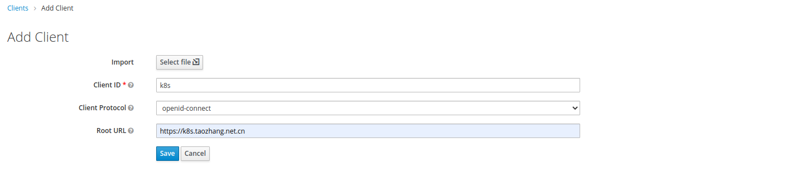
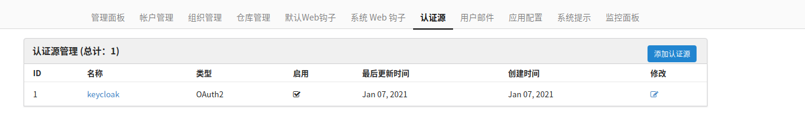

keycloak对接第三方客户端
==========================

## kuboard dashboard OIDC

[kuboard](http://press.demo.kuboard.cn/)是一款管理k8s图形化管理工具. 部署安装很简单.

```bash
kubectl apply -f https://kuboard.cn/install-script/kuboard.yaml
kubectl apply -f https://addons.kuboard.cn/metrics-server/0.3.7/metrics-server.yaml
```

k8s-openid realm > Clients > Add Client



具体kubaord和keycloak配置可以见[我的博客](https://www.taozhang.net.cn/archives/146.html#title-5), 里面详细写了步骤.


## harbor OIDC

Harbor > 配置管理 > 认证模式 > OIDC

| 配置项 | 配置值 |
| --- | --- |
| OIDC 供应商 | keycloack |
| OIDC Endpoint | https://keycloak.taozhang.net.cn/auth/realms/k8s-openid |
| OIDC 客户端标识 | harbor |
| OIDC 客户端密码 | ${harbor_client_secret_id}|
| 组名称  | groups |
| OIDC Scope | openid,email,profile,offline_access |

## gitea OIDC

管理后台 > 认证源

| 配置项 | 配置值 |
| --- | --- |
| 认证类型 | OAuth2 |
| 认证名称 | keycloak |
| OAuth2 提供程序 | OpenID Connect |
| 客户端 ID （键） | gitea |
| 客户端密钥  | ${gitea_client_secret_id} |
| OpenID 连接自动发现 URL | https://keycloak.taozhang.net.cn/auth/realms/k8s-openid/.well-known/openid-configuration |

