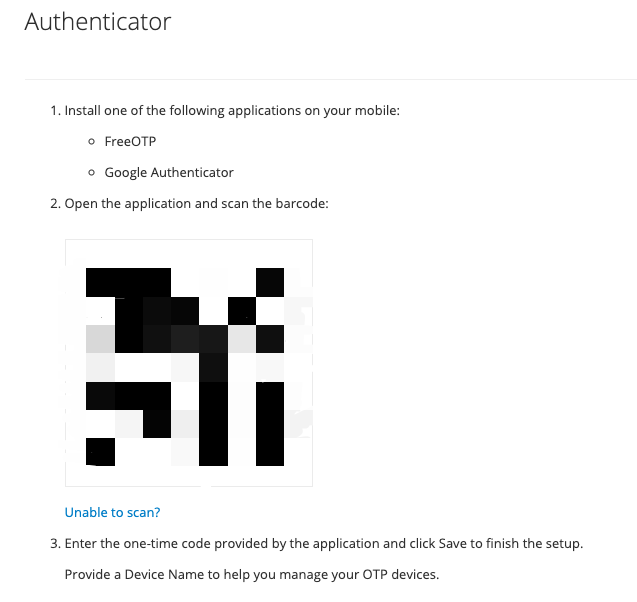
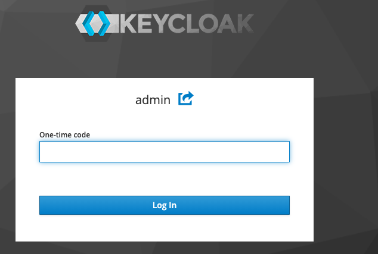
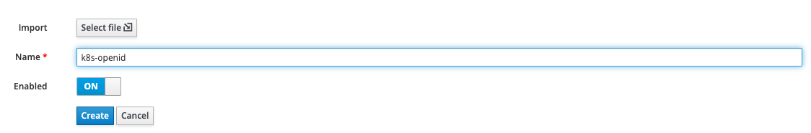
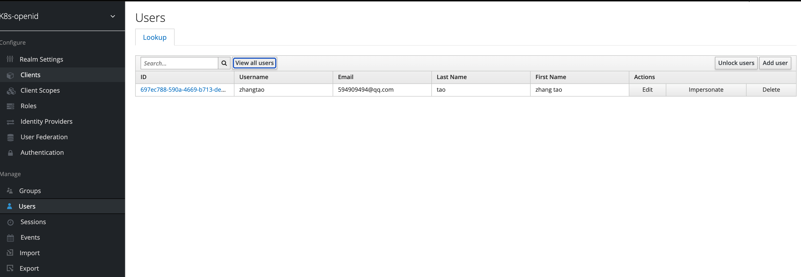
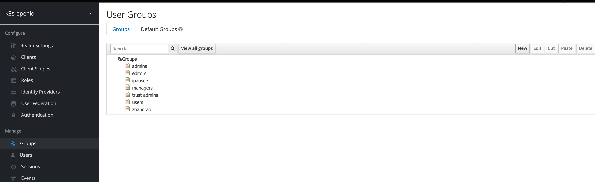
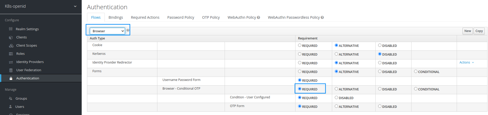

# keycloak 用户认证

> 配置keycloak OICD认证. 

## 管理员配置OTP

Manager account > Authenticator 

使用FreeOpt进行扫码绑定：

后续登录都需要使用 password + otp 登录了。

## Add k8s-openid realm

配置k8s-openid的realm(realm 类似与unix中的group), 用于k8s dashboard/harbor/gitea/kibana 等等的平台的oauth授权。

## ldap协议连接freeipa

k8s-openid > Configure > User Federation > Add Provider > ldap 

##### 同步user配置

| 配置项 | 配置值 |
| --- | --- |
| Console Display Name | freeipa |
| Vendor | Red Hat Directory Server |
| Username LDAP attribute | uid |
| RDN LDAP attribute | uid | 
| UUID LDAP attribute | nsuniqueid |
| User Object Classes | inetOrgPerson, organizationalPerson |
| Connection URL | ldap://${freeipa_ldap_host}:${freeipa_ldap_port}|
| Users DN | cn=users,cn=accounts,dc=taozhang,dc=net,dc=cn |
| Bind Type | simple |
| Bind DN | uid=admin,cn=users,cn=accounts,dc=taozhang,dc=net,dc=cn |
| Bind Credential | ${admin_password} |

##### 同步group配置

k8s-openid > Configure > User Federation > Ldap > Ldap Mappers， 创建mappers 命名为groups

| 配置项 | 配置值 |
| --- | --- |
| Mapper Type  | group-ldap-mapper |
| LDAP Groups DN | cn=groups,cn=accounts,dc=taozhang,dc=net,dc=cn |
| Group Name LDAP Attribute | cn |
| Group Object Classes  | posixGroup |
| Membership User LDAP Attribute  | cn |

配置好后，keycloak通过ldap协议从freeipa同步过来Users/Groups

## 普通用户配置OTP
k8s-openid > Configure > Authentication > Flows

设置后, 通过brower的普通用户需要配置otp和验证otp.