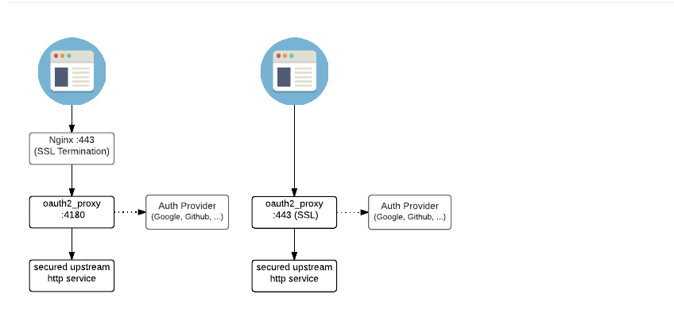

oauth2 proxy组件
===========================

> [oauth2 proxy](https://oauth2-proxy.github.io/oauth2-proxy/docs/)组件跟keycloak proxy类似. 但是功能更加强大, 性能更加好. 支持多种OAuth Provider. 具体可见官方配置文档.



## 对接keycloak

- configmap

```yaml
apiVersion: v1
kind: ConfigMap
metadata:
  labels:
    k8s-app: {client_id}-oauth
    version: v1
  name: {client_id}-oauth
data:
  oauth-proxy.cfg: |
    ## OAuth2 Proxy Config File
    ## https://github.com/oauth2-proxy/oauth2-proxy
    http_address = ":8080"
    reverse_proxy = true
    ## provider
    provider = "keycloak"
    client_id = "client_id"
    client_secret = ""
    login_url = "https://keycloak.taozhang.net.cn/auth/realms/k8s-openid/protocol/openid-connect/auth"
    redeem_url = "https://keycloak.taozhang.net.cn/auth/realms/k8s-openid/protocol/openid-connect/token"
    validate_url = "https://keycloak.taozhang.net.cn/auth/realms/k8s-openid/protocol/openid-connect/userinfo"
    redirect_url = "https://spug.taozhang.net.cn/oauth2/callback"
    insecure_oidc_allow_unverified_email=true
    keycloak_group = "/managers"
    scope = "openid email profile offline_access"
    upstreams = [
         "http://upstream_host:upstream_port"
    ]
    cookie_secret = "secrets"
    cookie_domains = [
      ".taozhang.net.cn"
    ]
    ## 可信email， 会与scope中的email对比。
    email_domains = [
      "*"
    ]
    pass_user_headers = true
    pass_access_token = true
    pass_authorization_header = true
```
[我的jaeger平台](https://jaeger.taozhang.net.cn)就是基于oauth2 proxy做认证的．

- deployment
  
```yaml
apiVersion: apps/v1
kind: Deployment
metadata:
  name: {client_id}-oauth
  labels:
    k8s-app: {client_id}-oauth
    version: v1
spec:
  replicas: 1
  selector:
    matchLabels:
      k8s-app: {client_id}-oauth
      version: v1
  template:
    metadata:
      labels:
        k8s-app: {client_id}-oauth
        version: v1
    spec:
      containers:
        - name: oauth
          image: quay.io/oauth2-proxy/oauth2-proxy:v6.1.1
          command: ["/bin/oauth2-proxy"]
          args:
          - --config=/etc/oauth-proxy.cfg
          volumeMounts:
            - mountPath: /etc/oauth-proxy.cfg
              name: conf
              subPath: oauth-proxy.cfg  
          ports:
            - containerPort: 8080
              protocol: TCP
          resources:
            limits:
              cpu: 300m
              memory: 256Mi
            requests:
              cpu: 100m
              memory: 64Mi
          livenessProbe:
            httpGet:
              path: /ping
              port: 8080
          readinessProbe:
            httpGet:
              path: /ping
              port: 8080
      volumes:
        - name: conf
          configMap:
            name: {client_id}-oauth
            items:
            - key: oauth-proxy.cfg
              path: oauth-proxy.cfg
```